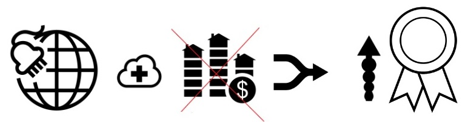
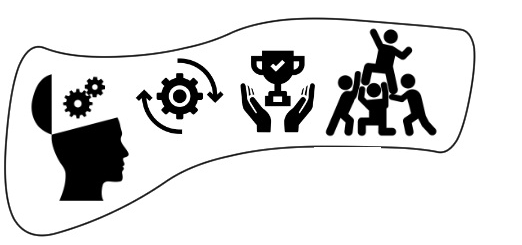
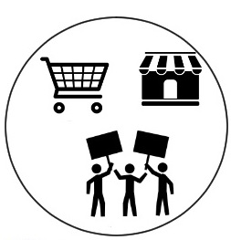
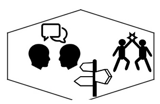

*¿eres consciente de que vivimos en un nuevo mundo conectado? ¿te gustaría aplicar unos conocimientos que te garanticen el éxito en este mundo de conexiones? ¿conoces el pensamiento visual como herramienta para conectar ideas?*

Vivimos en un nuevo mundo conectado, y esto ha supuesto el fin de la información escasa que servía para controlarnos fomentando el miedo…

miedo = ¡algo tan fácil de establecer cuando existe desconocimiento!

La nueva era de la información y el conocimiento en la que nos encontramos, unido al fin del crecimiento eterno que nos creímos tras la era de la industrialización y la burbuja inmobiliaria, nos conduce a **buscar nuevas habilidades para tener éxito en un nuevo mundo conectado y por descubrir.**

¿qué mejor forma de conectar e innovar que visualmente?

- - - - - -

El mundo cambia porque la sociedad cambia, y en muchas ocasiones esto sucede porque siempre buscamos progreso y con ello surgen nuevas tecnologías que suponen un antes y un después.

Internet y su fácil acceso ya en todos los rincones del mundo, ha conseguido que la información y **el conocimiento esté al alcance de todo el que quiera aprender y saber más en lo que ahora es un nuevo mundo conectado**.

¡La revolución de las conexiones está sobre nosotros!

¿pero las conexiones son sólo internet?

Yo creo que No!

Internet es una excelente herramienta que ha facilitado el boom de las conexiones, pero…

… lo que realmente tenemos que buscar y potenciar no es únicamente el aumentar la información de modo desmedido, ni tampoco pensar que todo pasa por aumentar la productividad…

… se trata de aumentar el VALOR!

¿cómo?

¡Conectando!

Si queremos garantizar nuestro éxito en un nuevo mundo conectado tenemos que **centrarnos en aportar valor**, convirtiéndonos en personas que sabemos:

CREAR INNOVANDO y APLICANDO LA MEJORA CONTINUA

LIDERAR BUSCANDO EL “WIN” DE TODAS LAS PARTES

ENCONTRANDO SIEMPRE LO REALMENTE IMPORTANTE

**Si quieres que te avise de otros recursos como estos, y además acceder a más información sobre los conceptos del pensamiento visual, te invito a suscribirte para no perderte nada.**

[*¡Ok, me apunto!*](https://www.pensamientovisual.es/suscripcion/)

- - - - - -

En definitiva se trata de crear conexiones entre:

COMPRADORES &amp; VENDEDORES

PRODUCTORES &amp; CONSUMIDORES

APASIONADOS &amp; TRIBUS

Si te centras en siempre aportar valor en base a lo mencionado tendrás éxito garantizado.

**Aplicar el pensamiento visual te ayudará sin duda a tener una visión global que te oriente, pero también te permitirá comunicarte mejor y con ello llegar a la mejor solución fruto del buen entendimiento, y así realmente aportar valor.**

- - - - - -

Hemos llegado al fin de la información escasa y con ello tenemos que dejar atrás la idea de la vieja escuela de fomentar la inteligencia en base al [acumulo de información](https://www.pensamientovisual.es/deja-de-memorizar-y-ser-un-producto-intercambiable-del-sistema-escolar/).

En nuevo mundo conectado como el nuestro, la información es abundante y las posibilidades de conexión ilimitadas, por lo que **si queremos tener éxito la clave está en mejorar nuestra capacidad y habilidades para ser más eficaces aprendiendo, conectando e interactuando.**

¿hay un modo mejor de potenciar las habilidades necesarias para garantizar tu éxito en un nuevo mundo conectado que aplicando el [pensamiento visual](https://www.pensamientovisual.es/el-abc-del-pensamiento-visual/)?

La sociedad en general ha fomentado el miedo como un atajo a la obediencia y el aumento de la productividad, y esto unido a la desinformación que en muchos aspectos ha existido, ha funcionado perfectamente para establecer el poder entre “bandos”:

- ESCUELA &amp; ALUMNOS: No más materias irrelevantes y enseñanza basada en la memorización
- JEFES &amp; TRABAJADORES: No más todos somo iguales y no podemos expresarnos
- COMPRADORES &amp; PROVEEDORES: No más control absoluto sin buscar el “win” común
- BANCOS &amp; CONSUMIDORES: No más engaños basados en el desconocimiento

¡El miedo y la desinformación ya no es un atajo hacia la obediencia y el poder!

¡Necesitamos comunicación eficaz y transparente!

Ahora nos guste o no, a todos nos toca interactuar entre nosotros en base a:

DIALOGAR y RAZONAR

SEÑALAR DIFERENTES OPCIONES

BUSCAR SOLUCIONES

Gracias a un nuevo mundo conectado con mayor información a nuestro alcance, la obediencia no se puede conseguir con el miedo que se ha pretendido establecer fruto de la desinformación.

MIEDO = fácil de despertar y mantener = tóxico de la sociedad

¡El otro lado del miedo es la pasión!

PASIÓN = sin esfuerzo buscar más información y comprenderlo rápidamente = parte del individuo

Por tanto…

¡Necesitamos más artistas creativos e innovadores!

y sin duda…

[¡Necesitamos fomentar el pensamiento visual!](https://www.pensamientovisual.es/el-abc-del-pensamiento-visual/)

porque nos guste o no…

¡Estamos inmersos en la revolución de las conexiones!

siendo una buena alternativa…

¡Aplicar el pensamiento visual para garantizar tu éxito en un nuevo mundo conectado!

- - - - - -

**Si quieres aprender más sobre el pensamiento visual, te invito a suscribirte gratis a la web para no perderte nada, y poder así acceder a la intranet formativa con el ABC del Pensamiento Visual.**

[¡Ok, me apunto!](https://www.pensamientovisual.es/suscripcion/)

<https://www.pensamientovisual.es/producto/abc-pensamiento-visual/>

.

*Si te ha gustado, ayúdame* *a difundirlo por las redes sociales. ¡gracias!*