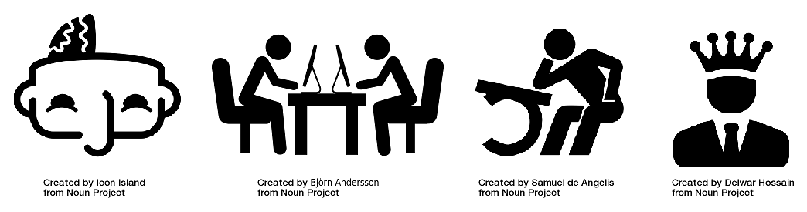
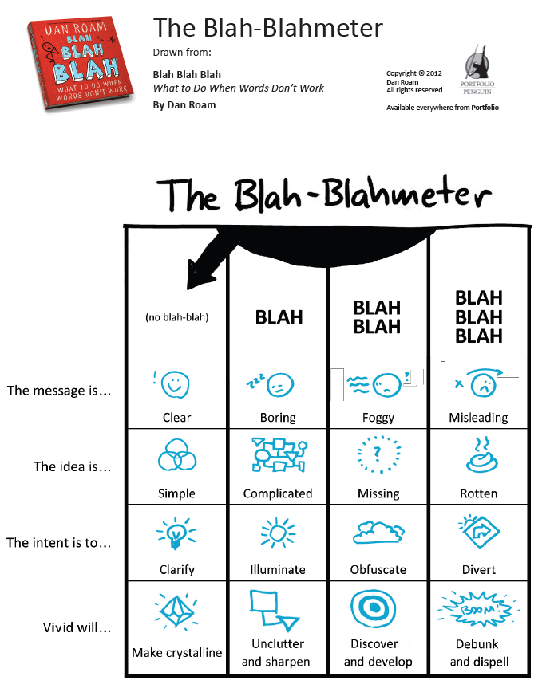
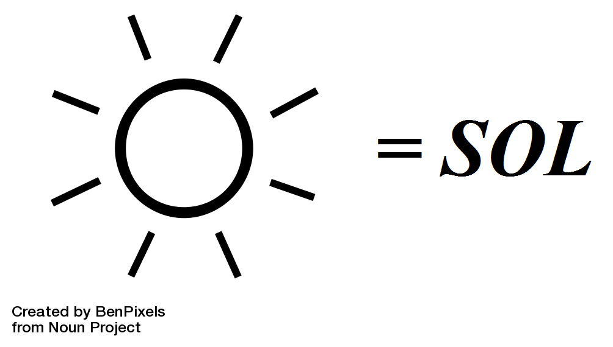
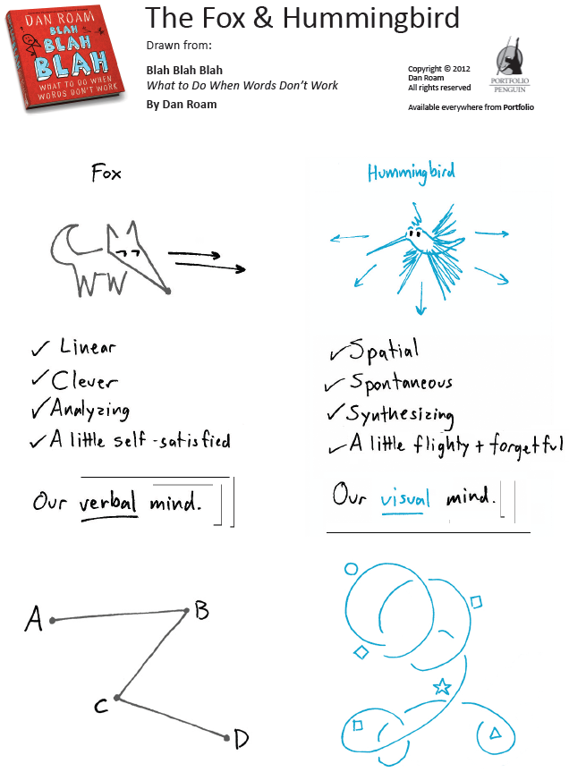
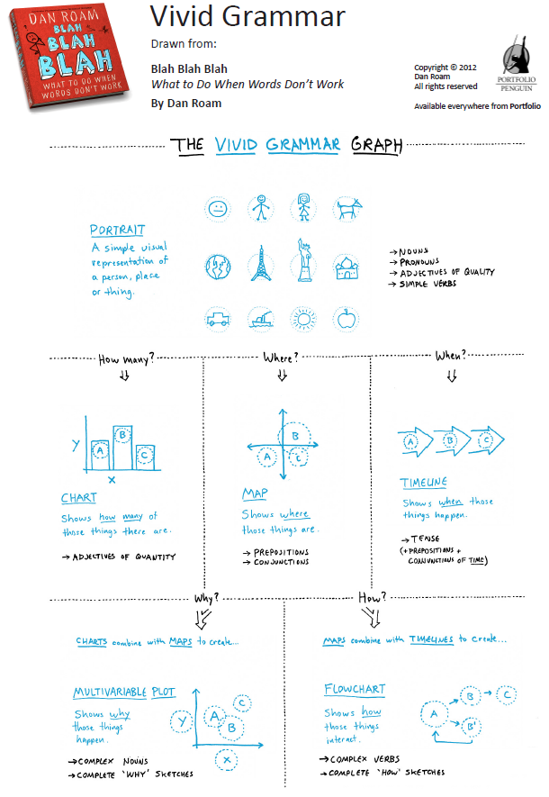
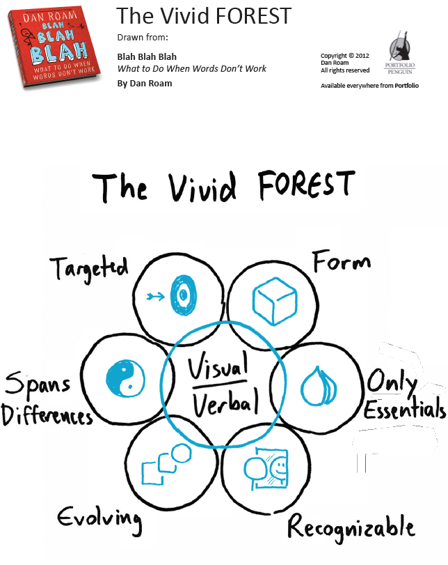

*¿eres consciente de que hablamos tanto que no pensamos bien? ¿después de escuchar a alguien te has quedado con la sensación de saber menos que al principio? ¿estas cansado de malgastar tu tiempo atendiendo algunos discursos, charlas y reuniones interminables y que no te aportan nada?*

*¡Bienvenido al mundo del Bla, Bla, Bla!*

Como predica [Dan Roam en su “libro Bla Bla Bla”, ](http://amzn.to/2bawIgS)aunque las palabras tienen mucho poder, estamos engañados al pensar que las palabras por sí solas, pueden detectar, describir y resolver los problemas actuales y futuros.

¿sólo nos comunicamos con palabras?

¡ Esto es sin duda un grave problema de comunicación y entendimiento!

Según Dan Roam y su libro “Bla Bla Bla” la respuesta es **PENSAMIENTO VIVIDO: técnica que combina nuestra mente verbal y visual para que puedas pensar y aprender más rápido.**

Dan Roam es un referente en el desarrollo y enseñanza del pensamiento visual, y tras el éxito de su libro [“Tu mundo en una servilleta”, ](http://www.amazon.es/gp/product/8498750628/ref=as_li_ss_tl?ie=UTF8&camp=3626&creative=24822&creativeASIN=8498750628&linkCode=as2&tag=informate-21)profundizó más en el arte de comunicar visualmente con su nuevo “libro Bla Bla Bla”.

¡El pensamiento vivido ofrece un método para aclararlo todo!

En este nuevo libro Dan Roam intenta demostrar que podemos aplicar el pensamiento vivido como un sistema para eliminar el Bla Bla Bla de nuestras vidas para siempre, y que este sirve para tod@s:

- Mentes analíticas que odian dibujar
- Mentes emocionales que odian escribir

**Con sus enseñanzas podrás alejarte de aburridos y complejos discursos, para conseguir transmitir tus ideas de un modo eficaz y entretenido gracias al uso de dibujos y el pensamiento visual.**

¡Disfruta compartiendo tus ideas de una forma totalmente nueva!

¡Acaba con el Bla Bla Bla!

En definitiva, si te interesa el pensamiento visual te recomiendo totalmente la compra de este libro de [Dan Roam: “Bla, Bla, Bla: qué hacer cuando las palabras no funcionan”](http://amzn.to/2bawIgS): **va dirigido a las personas inquietas como tu (personas multipotenciales), para ayudarte a innovar en tu forma de comunicar, vender y potenciar ideas creativas!**

En esencia, el libro Bla Bla Bla te ayudará a encontrar un equilibrio entre:

- tu mente racional: representada por un “zorro”
- tu mente más creativa e imaginativa: representada por un “colibrí”

Realmente es un libro bastante extenso, en el que se presentan muchas metodologías propias de Dan Roam para tratar de conseguir llegar a ese equilibro VISUAL &amp; VERBAL, por lo que tal vez llegue a ser algo más complejo de seguir y entender que su inicial metodología presentada en su anterior libro [“Tu mundo en una servilleta”.](http://www.amazon.es/gp/product/8498750628/ref=as_li_ss_tl?ie=UTF8&camp=3626&creative=24822&creativeASIN=8498750628&linkCode=as2&tag=informate-21)

En cualquier caso, a mí me parece este libro mucho mejor y más completo que el anterior, pero hay que analizarlo con tiempo para asimilarlo, entenderlo y sacarle todo el potencial que realmente tiene.

**Si quieres que te avise cuando reseñe otros libros como este, y además acceder a más información sobre los conceptos del pensamiento visual, te invito a suscribirte para no perderte nada.**

[*¡Ok, me apunto!*](https://www.pensamientovisual.es/suscripcion/)

- - - - - -

[**“Bla, Bla, Bla: qué hacer cuando las palabras no funcionan”**](http://amzn.to/2bawIgS)

El libro está dividido principalmente en 3 partes, presentado cada vez una herramienta:

1. Planteamiento del problema del “Bla, Bla, Bla”
2. Antídoto contra el problema: “Pensamiento Vivido”
3. Desarrollo de su metodología denominada “FOREST” (bosque): un mapa que nos lleva del terreno de las palabras al de los dibujos de modo conectado.

- - - - - -

**INTRODUCCIÓN**

Bla, bla, bla: tres palabritas que están destruyendo tu capacidad de PENSAR, TRABAJAR, APRENDER y LIDERAR.

¿ y por qué afirma esto Dan Roam?

Porque…

- Pensar con palabras es limitado ya que sólo potencia la mitad de tu inteligencia.
- Es aburrido por lo que disminuye tu rendimiento e implicación.
- Por lo anterior, limita tu capacidad de aprender al ser aburrido y limitado.
- Genera malentendidos, destruyendo así tu capacidad de liderar.

- - - - - -

**PARTE 1: El BLABLÁMETRO**

Evidentemente no todas las palabras ni discursos son puro Bla, Bla, Bla,.. realmente las palabras son mágicas, pero usadas correctamente.

¿pero qué pasa cuando no se usan correctamente las palabras?

Puede provenir de un error inocente al no usar las palabras adecuadas para describir algo, pero en el otro extremo también puede ser pura maldad, al distraer con palabras el fondo de una idea podrida.

El Blablámetro son un serie de reglas presentadas en forma de tabla que te ayudarán a detectar el nivel de Bla, Bla, Bla de todo lo que te encuentres; siendo también útil para uno mismo auto controlarse:

- El mensaje es: claro, aburrido, confuso o desacertado.
- La idea es: simple, complicada, inexistente o podrida.
- La intención es: aclarar, clarificar, ofuscar o distraer.
- La vivido: lo hará cristalino, pondrá orden, desarrollará o desenmascarar.

- - - - - -

**PARTE 2: INTRODUCCIÓN AL PENSAMIENTO VIVIDO**

Se presenta en primer lugar la importancia de potenciar toda nuestra mente, incluyendo así las dos partes del cerebro: doble visión.

Aquí se representa con el “zorro” (mente verbal) y el “colibrí” (mente visual) las dos formas de ver y entender el mundo.

La solución para que trabajen juntas se resume en 3 reglas del pensamiento vivido:

1. Con cada palabra haces un dibujo y viceversa.
2. Si no sabes qué dibujar usas la GRAMÁTICA VÍVIDA
3. Para convertir una idea en vivida aplica los 7 pasos del FOREST.

La herramienta desarrollada en el resto del capítulo es la GRAMÁTICA VIVIDA: es un conjunto de directrices que te muestran cómo evitar el “Bla, Bla, Bla”, conectando tu mente verbal y visual fácilmente.

De modo similar al libro [“Tu mundo en una servilleta”](http://www.amazon.es/gp/product/8498750628/ref=as_li_ss_tl?ie=UTF8&camp=3626&creative=24822&creativeASIN=8498750628&linkCode=as2&tag=informate-21) la **gramática vivida pone de manifiesto 6 dibujos elementas: Quién=retrato, Cuanto=gráfico, Dónde=mapa, Cuándo=línea tiempo, Cómo=diagrama flujo, Por qué= gráfico variables múltiples.**

- - - - - -

**PARTE 3: LOS 7 ELEMENTOS ESENCIALES DE UNA IDEA VÍVIDA**

La tercera herramienta y más extensa es el BOSQUE VIVIDO = FOREST

El objetivo de esta herramienta FOREST es presentarte un mapa con el que conseguir que las ideas sean apasionantes, claras y memorables.

A lo largo del libro entra en detalle en explicar, desarrollar y poner ejemplos de todas las partes que en resumen son:

- ***VÍVIDO: las ideas vívidas se expresan con palabras y dibujos***
- ***F: las ideas vívidas tienen forma → gráfico gramatical***
- ***O: las ideas vívidas muestran sólo lo esencial → filtrado***
- ***R: las ideas vívidas son reconocibles → metáforas visuales***
- ***E: las ideas vívidas evolucionan → abierta al cambio***
- ***S: las ideas vívidas engloban diferencias → ver el ying &amp; yang***
- ***T: las ideas vívidas están dirigidas → conoce a tu audiencia***

Al final del libro Bla, Bla, Bla se incluye una cuarta parte de conclusiones y varios apéndices:

- Cómo perdimos la mitad de nuestra mente
- Conexiones con “Tu mundo en una servilleta”
- La lista de control del pensamiento vivido completa.

- - - - - -

Si te interesa el pensamiento visual, además de seguir este blog, este libro es una buena forma de profundizar: [“Bla, Bla, Bla: qué hacer cuando las palabras no funcionan” de Dan Roam.](http://amzn.to/2bawIgS)

¿Sigues dudando del potencial del pensamiento visual?

Si eres un profesional del conocimiento, estoy seguro de que te será de gran ayuda.

- - - - - -

**Si quieres aprender más sobre el pensamiento visual, te invito a suscribirte gratis a la web para no perderte nada, y poder así acceder a la intranet formativa con el ABC del Pensamiento Visual.**

[¡Ok, me apunto!](https://www.pensamientovisual.es/suscripcion/)

<https://www.pensamientovisual.es/producto/abc-pensamiento-visual/>

.

*Si te ha gustado, ayúdame* *a difundirlo por las redes sociales. ¡gracias! 😉*