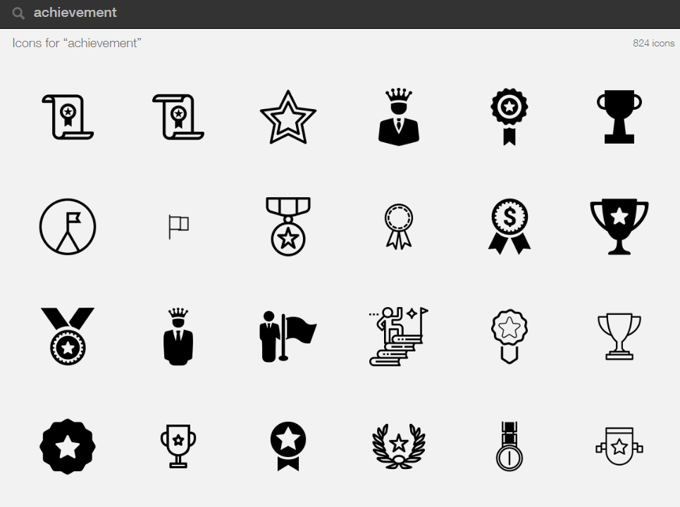
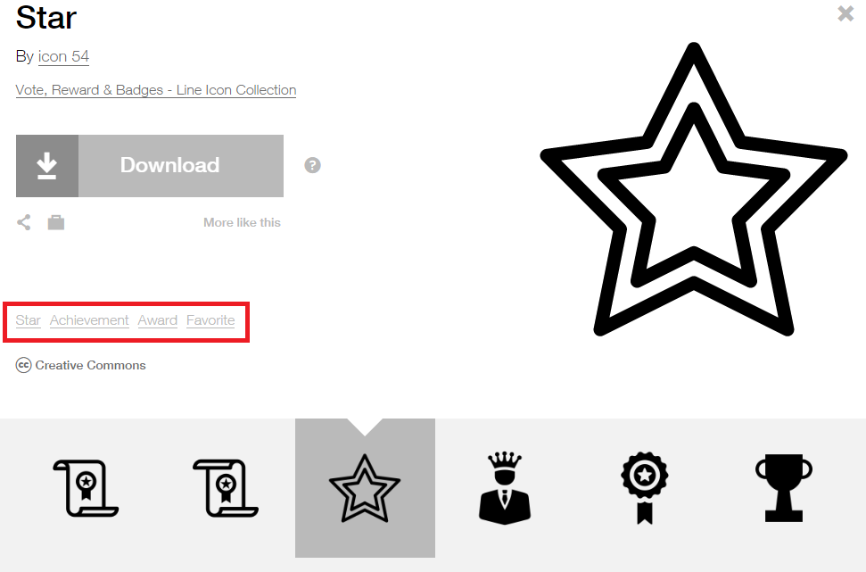
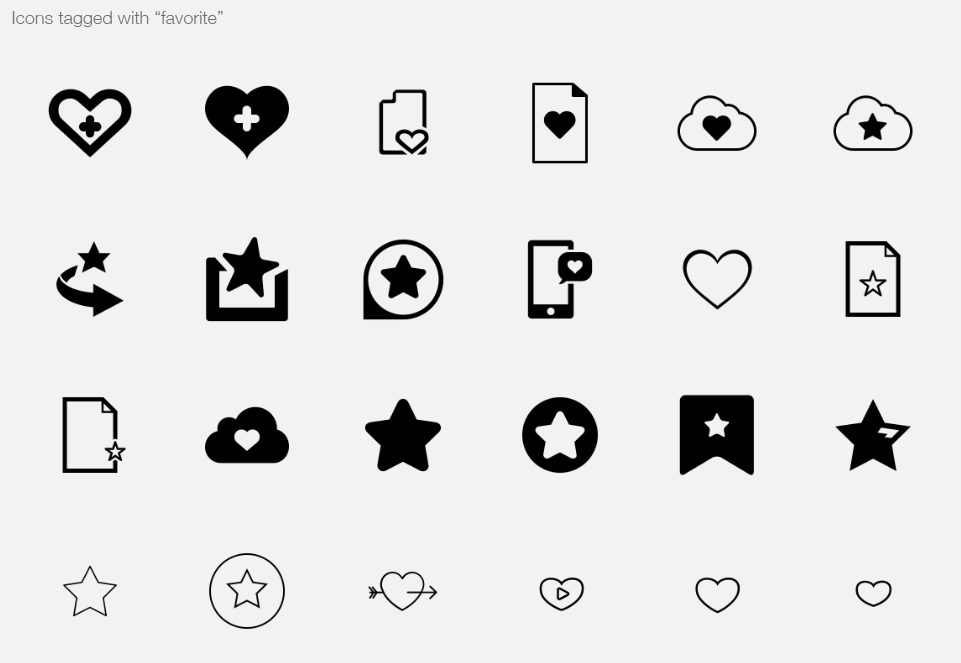
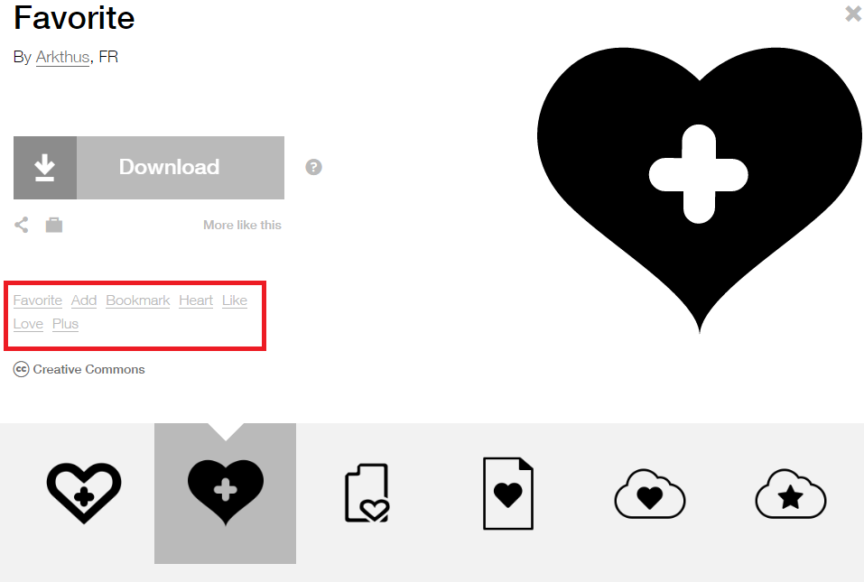

*¿te gustaría pensar en imágenes más fácilmente? ¿quieres comunicar de un modo más entretenido y eficaz? ¿y si pensar en imágenes pasa a ser tu modo habitual de aprender, enseñar y resolver?*

Independientemente de tus capacidades de dibujar o bocetar simples símbolos, o imágenes más o menos elaboradas, si te acostumbras a potenciar el hecho de pensar en imágenes, lograrás disponer de una gran ayuda a la hora de comunicar tus ideas.

Uno de los fundamentos del pensamiento visual, es precisamente pensar en imágenes, en concordancia a [cómo funciona nuestro cerebro](https://www.pensamientovisual.es/como-funciona-tu-cerebro/), el cual es muy visual.

Cuanto más aprendas a pensar en imágenes, mejor podrás aplicarlo en tu comunicación con otros, consiguiendo así hacer tus ideas memorables y con mayor capacidad de retención tanto para tí como para tu público.

**Para saber cómo pensar en imágenes, lo primero que tienes que hacer es aprender a dar significado a las imágenes, dibujos o bocetos.**

Aquí algunas cosas a tener en cuenta para ello:

- Cada dibujo o imagen puede llevar asociado múltiples significados.
- Con un simple dibujo que aprendas a realizar, lo puedes utilizar para representar muchas ideas.
- Colocar una palabra al lado de cada dibujo concretará el significado que quieras transmitir, pero manteniendo el dibujo como elemento visual y recordatorio de la idea.
- Puedes recurrir a “Google” o “Noun Project” para encontrar inspiración, por lo que esto está al alcance de todos, independientemente de que tengas ejercitado más o menos esta capacidad de pensar en imágenes.

Si quieres dibujar tus propios bocetos, te recomiendo la siguiente entrada del blog para convencerte de que no tienes que tener ninguna cualidad artística para ello: [Dibujar garabatos, monigotes y emociones!](https://www.pensamientovisual.es/dibujar-garabatos-monigotes-emociones/)

También me parece importante que descubras los libros de Ed Emberley para realizar dibujos esquemáticos: [Ed Emberley-libros de dibujo esquemático](https://www.pensamientovisual.es/ed-emberley-libros-dibujo-esquematico/)

**Si quieres que te avise de otros recursos como estos, y además acceder a más información sobre los conceptos del pensamiento visual, te invito a suscribirte para no perderte nada.**

[*¡Ok, me apunto!*](https://www.pensamientovisual.es/suscripcion/)

- - - - - -

Te presento algunos ejemplos de inspiración para pensar en imágenes, dando significado a las mismas de un modo fácil y rápido gracias al proyecto: 

[The Noun Project: biblioteca universal de iconos para aplicar el pensamiento visual ](https://www.pensamientovisual.es/the-noun-project-biblioteca-universal-de-iconos-para-aplicar-el-pensamiento-visual/)

Por ejemplo si realizas la búsqueda de **“Achievement”,** tendrás cientos de iconos que podrías usar para representarlo.

Pero si sólo te fijas en uno, por ejemplo la primera estrella, podrás ver cómo el propio autor de ese icono te recomienda que lo puedes usar para **representar varios significados con la misma imagen:** 

**Star (estrella), Achievement (logro), Award (premio), Favorite (favorito)**

Si pruebas a “clicar” en alguno de estos significados, directamente te mostrará una nueva búsqueda con todos los iconos recomendados para representar ese significado. Por ejemplo si doy a “favorite”:

Y si vuelves a entrar a uno de esos iconos nuevamente podrás ver todos los significados que puedes dar a ese icono, y por tanto **con una sola imagen poder utilizar para representar:** 

**Favorite (favorito), Add (añadir), Bookmark (marcador), Heart (corazón), Like (gustar), Love (amor), Plus (más).**

Así de fácil puedes ir buscando iconos para cualquier palabra o idea que quieras representar, y al mismo tiempo encontrar múltiples significados para una misma imagen, teniendo así al alcance de todos el poder pensar en imágenes.

Sin lugar a dudas con “Google” también puedes buscar imágenes rápidamente, pero a diferencia de usar [The Noun Project](https://www.pensamientovisual.es/the-noun-project-biblioteca-universal-de-iconos-para-aplicar-el-pensamiento-visual/) tendrás las siguientes desventajas:

- No vas a poder encontrar otros significados para una misma imagen.
- A priori no deberías descargarlas, ya que por estar en “Google” no quiere decir que puedas usarlas como si fueran tuyas.

- - - - - -

En definitiva, **parece obvio que un único símbolo, imagen, o icono, puede representar varias cosas o significados, sin embargo, aquí está la clave fundamental que te ayudará de un modo sencillo a representar muchas ideas diferentes con pocos recursos y habilidades de dibujo.**

Por otra parte, por eso mismo de que una imagen puede tener varios significados o interpretaciones, no se podrá afirmar que una representación pueda estar bien o mal de modo categórico, y mucho menos si siempre acompaña a nuestras explicaciones como punto de referencia y no como modo de comunicación única y aislada.

La otra conclusión que debes tener en cuenta de todo esto…

**… es que puedes usar los mismos símbolos aprendidos una y otra vez!**

Puedes exprimir al máximo, y darle muchos usos a cada simple dibujo que aprendas a representar. 

La razón de que podamos dar múltiples significados a un mismo símbolo al pensar en imágenes, es que **nuestro cerebro rápidamente acepta el significado sugerido a una imagen**, siempre y cuando sea lo suficientemente verosímil. Esto se debe a que cuando tomas cualquier información, siempre buscas significados para darle sentido a la misma.

Por todo ello, **es muy importante que coloques acompañando a cada dibujo, icono o imagen, una palabra o frase que concrete los múltiples significados que se podrían interpretar de la misma.** De este modo aseguras que tu audiencia lo interpreta exactamente del modo que tu quieres. A partir de ese momento cada vez que vean la imagen sabrán qué significado le estás dando en tu contexto particular.

**¡ Usar palabras e imágenes juntas es una herramienta muy poderosa de comunicación visual!**

Cuando usamos una palabra y una imagen juntos, se crea una conexión muy fuerte que ayuda a conectar las ideas y guardarlas en la memoria. Cuanto más creativa e inusual sea esa conexión imagen-palabra para representar una idea o concepto, más efectiva será a la hora de recordarla.

Y recuerda que no hay una imagen concreta para representar cada idea. Tan sólo tu imagen sea lo suficientemente cercana a los términos y significados que necesites representar, ya será válida para comunicar tu idea.

En conclusión, recuerda lo siguiente para comunicar y pensar en imágenes:

- Usa imágenes y palabras juntas para crear una conexión de ayuda mutua entre ambas.
- Una imagen, icono, boceto,… puede representar múltiples ideas o conceptos, por lo que úsalos en diferentes situaciones una y otra vez.

Teniendo todo esto en cuenta, ya tienes una base y ayuda más para empezar a comunicar de un modo más entretenido y eficaz, al pensar en imágenes. Además, gracias a internet y páginas como “The Noun Project”, esto está al alcance de cualquiera, tengas más o menos imaginación para ello. 

De todos modos, lo ideal es que puedas crear tus propias imágenes y bocetos únicos, por lo que te recomiendo leer: [Anímate a dibujar en digital con una tableta gráfica Wacom](https://www.pensamientovisual.es/animate-dibujar-digital-con-tableta-grafica-wacom/)

Espero que a partir de ahora te sea más fácil pensar en imágenes, y por ello sea algo más habitual en tí, tanto en el momento de aprender, como para enseñar y comunicar gracias al mayor uso del pensamiento visual.

- - - - - -

**Si quieres aprender más sobre el pensamiento visual, te invito a suscribirte gratis a la web para no perderte nada, y poder así acceder a la intranet formativa con el ABC del Pensamiento Visual.**

[¡Ok, me apunto!](https://www.pensamientovisual.es/suscripcion/)

.

*Si te ha gustado, ayúdame* *a difundirlo por las redes sociales. ¡gracias! 😉*