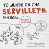

*¿Qué pasaría si existiera un modo de hacer más eficiente y divertida la solución de problemas? ¿conoces la mejor forma de constatar que realmente entiendes un tema y mostrarlo a tu cliente? ¿te gustaría descubrir ideas a priori invisibles, desarrollarlas rápida e intuitivamente, y luego compartirlas para una inmediata comprensión?*

[Según Dan Roam y su libro “Tu mundo en una servilleta”](http://www.amazon.es/gp/product/8498750628/ref=as_li_ss_tl?ie=UTF8&camp=3626&creative=24822&creativeASIN=8498750628&linkCode=as2&tag=informate-21) la respuesta es **PENSAMIENTO VISUAL: resolver problemas y transmitir ideas mediante dibujos.** Yo lo he comprado y lo recomiendo totalmente como un primer acercamiento a este apasionante mundo con el que aprovechar esta capacidad innata que todos tenemos.

Dan Roam es un referente en el desarrollo y enseñanza del pensamiento visual, y concretamente ayuda a los ejecutivos a resolver problemas a través de esta temática.

El libro que os quiero presentar [“Tu mundo en una servilleta”](http://www.amazon.es/gp/product/8498750628/ref=as_li_ss_tl?ie=UTF8&camp=3626&creative=24822&creativeASIN=8498750628&linkCode=as2&tag=informate-21) y que os recomiendo comprar de este reconocido autor, vendió sólo en Estados Unidos más de 150.000 ejemplares; estando traducido a veinte lenguas distintas, y elegido como uno de los libros del año por prestigiosas revistas de negocios.

**“El pensamiento visual”: la caja de herramientas para resolver problemas que se puede llevar a cualquier parte.**

Como no podía ser de otra manera el libro es muy visual, aunque no tan radicalmente visual como su otro libro sobre presentaciones: [“Haz que tu presentación sea algo extraordinario”](http://www.amazon.es/gp/product/849875383X/ref=as_li_ss_tl?ie=UTF8&camp=3626&creative=24822&creativeASIN=849875383X&linkCode=as2&tag=informate-21).

Realmente fue este libro de presentaciones el que me llamó la atención un día en el Corte Ingles y el primero que adquirí sin saberlo sobre pensamiento visual como ayuda en mi trabajo; siendo este libro el que me llevó a descubrir a Dan Roam.

En mi caso fue un punto de inflexión descubrir a Dan Roam y lo que contaba del pensamiento visual, ya que conectaba con todos mis pensamientos…

…ponerle nombre a esta temática me llevó a querer saber más, comprando en segundo lugar “Tu mundo en una servilleta”, y afianzando de modo paulatino mis ganas de continuar aprendiendo sobre ello, ya que me sentía identificado con este modo de ver las cosas.

**Si quieres que te avise cuando reseñe otros libros como este, y además acceder a más información sobre los conceptos del pensamiento visual, te invito a suscribirte para no perderte nada.**

[*¡Ok, me apunto!*](https://www.pensamientovisual.es/suscripcion/)

- - - - - -

Descubrir el pensamiento visual gracias a [“Tu mundo en una servilleta”](http://www.amazon.es/gp/product/8498750628/ref=as_li_ss_tl?ie=UTF8&camp=3626&creative=24822&creativeASIN=8498750628&linkCode=as2&tag=informate-21), me permitió intuir lo que podría ser una fantástica manera de:

- **Enfocar no sólo la resolución de problemas como lo plantea Dan Roam**
- **Facilitar el autoaprendizaje que tanto he desarrollado**
- **Y en general toda la propagación del conocimiento que tan necesaria veo en el presente y futuro.**

A grandes rasgos el libro está dividido en cuatro partes:

1. Comienza con una introducción al pensamiento visual
2. Una segunda parte sobre descubrir ideas
3. Luego continua con el desarrollo de estas ideas
4. Y finalmente trata cómo vender las ideas.

Al final del mismo incluye un montón de referencias y recursos para profundizar más, así como un apéndice con un enfoque más científico.

**[DAN ROAM: “TU MUNDO EN UNA SERVILLETA” = The Back of the Napkin](http://www.amazon.es/gp/product/8498750628/ref=as_li_ss_tl?ie=UTF8&camp=3626&creative=24822&creativeASIN=8498750628&linkCode=as2&tag=informate-21)**

- - - - - -

**INTRODUCCIÓN**

*A cualquier hora, cualquier persona, en cualquier lugar: Resolver problemas mediante dibujos.*

Dan Roam cuenta una historia propia de cómo resolvió una presentación inesperada que tenía que liderar para cubrir a un compañero ausente y sobre la cual no tenía nada preparado.

Resumió todo con un simple dibujo que plasmó en una servilleta mientras acudía en tren a la importante presentación. Con sólo ver ese dibujo podía recordar todo lo que quería contar, facilitando además el poder conectar con el público.

¡ Fue su propio descubrimiento del pensamiento visual!

**Tras esto, presenta una clasificación de todos los tipos de problemas que puedan existir resumidos en 6 tipos, y que van asociados a 6 preguntas:**

**¿Who-quién?**

**¿How much-cuánto?**

**¿Where- dónde?**

**¿When-cuándo?**

**¿How-cómo?**

**¿Why-por qué?**

Como más importante de este apartado, destacar su explicación sobre el proceso del pensamiento visual, aunque realmente no sea siempre lineal:

1. ***MIRAR**: recopilar y seleccionar*
2. ***VER**: seleccionar y agrupar*
3. ***IMAGINAR**: ver lo que no está presente*
4. ***MOSTRAR**: dar claridad a todo*

- - - - - -

**DESCUBRIR IDEAS**

*Mirar mejor, ver más claro, imaginar más allá: las herramientas y las reglas de un buen pensamiento visual.*

En primer lugar nos explica cómo MIRAR: nuestro entorno, datos, información,.. y una serie de reglas para potenciar la calidad de cómo miramos.

A continuación de modo similar a los 6 tipos de problemas, profundiza en los 6 modos de ver mediante algunos ejemplos prácticos a nivel personal y profesional.

**El punto más importante de este apartado sería la presentación de una herramienta muy potente para desarrollar la imaginación de modo visual y que llama SCVID, poniendo con ello de manifiesto que imaginar no es un proceso mágico, sino simplemente otra forma de ver.**

El SCVID nos ayuda a imaginar cuales son los mensajes visuales que quisiéramos transmitir antes de preocuparnos por los dibujos elegidos.

Desarrolla con un sencillo ejemplo esta herramienta de activación de la imaginación visual con 5 simples preguntas, llevando a nuestra idea inicial a un nivel de claridad visual y de mejor enfoque.

Por último nos ayuda a presentar un buen marco con la regla 6X6, la cual correlaciona las seis maneras de ver con las seis maneras de mostrar, estableciendo para cada pregunta un tipo de dibujo.

**Juntando ambas herramientas y sabiendolas utilizar se tiene ya una buena base para empezar a trabajar el pensamiento visual.**

- - - - - -

**DESARROLLAR IDEAS**

*La maestría del pensamiento visual: poner a funcionar el pensamiento visual*

Mediante muchos ejemplos y dibujos, el objetivo de este apartado es potenciar el SCVID y el 6×6, buscando las representaciones adecuadas para poder desarrollar todo aquello que se nos ocurra y necesitemos.

A grandes rasgos tendríamos que la contestación de cada pregunta se refleja como un dibujo básico, que será para …

***Quién=retrato***

***Cuanto=gráfico***

***Dónde=mapa***

***Cuándo=línea tiempo***

***Cómo=diagrama flujo***

***Por qué= gráfico variables múltiples….***

habiendo dentro de cada tipo multiples opciones.

- - - - - -

**VENDER IDEAS**

*¡Que empiece la función!*

En este corto apartado se vuelve a insistir en las mismas ideas pero esta vez enfocadas en el modo en que se venden y representan las ideas tras todo el proceso de descubrimiento y desarrollo.

En definitiva se trata de ayudar a nuestro receptor mostrándole nuestras ideas y conceptos del mismo modo que las hemos descubierto y desarrollado: empiece y mire en voz alta, siga y vea en voz alta, continúe e imagine en voz alta, para cerrar mostrando en voz alta.

Para terminar y a modo de resumen y conclusión, **representa todos los conceptos de modo visual a modo de navaja suiza**. Recordándola podrás poner en práctica el pensamiento visual en cualquier circunstancia y lugar.

Si quieres profundizar en el pensamiento visual, además de seguir este blog, este libro es un buen punto de partida: [“Tu mundo en una servilleta” de Dan Roam](http://www.amazon.es/gp/product/8498750628/ref=as_li_ss_tl?ie=UTF8&camp=3626&creative=24822&creativeASIN=8498750628&linkCode=as2&tag=informate-21).

*¿Sigues dudando del potencial de pensamiento visual?*

*Preocúpate por saber un poco más cada día, y para ello lo mejor que puedes hacer es suscribirte al blog para mantenerte informado. Si eres un profesional del conocimiento, estoy seguro de que te será de gran ayuda.*

- - - - - -

**Si quieres aprender más sobre el pensamiento visual, te invito a suscribirte gratis a la web para no perderte nada, y poder así acceder a la intranet formativa con el ABC del Pensamiento Visual.**

[¡Ok, me apunto!](https://www.pensamientovisual.es/suscripcion/)

<https://www.pensamientovisual.es/producto/abc-pensamiento-visual/>

.

*Si te ha gustado, ayúdame* *a difundirlo por las redes sociales. ¡gracias! 😉*