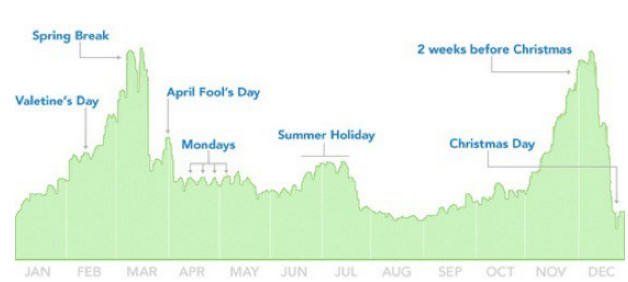

### Charla TED de David Mccandless

Te presento la charla TED de David Mccandless, la cual está muy en sintonía con las ideas que se destacan en esta web.

¡La belleza de la visualización de datos!

No recuerdo si lo descubrí por sus libros o por esta charla TED, pero en cualquier caso te recomiendo tener en cuenta las aportaciones de David Mccandless.

El mismo que proviene del mundo de la programación y el periodismo, también está descubriendo todo esto de la visualización de datos. 😉

David Mccandless se presenta en su web como escritor, diseñador, director creativo y artístico residente en Londres.

Si quieres saber más sobre él, e incluso ver su curriculum visual… pero sobre todo descubrir el poder de la visualización de datos no te pierdas su charla TED.

**Si además estás ya convencido, o te quieres convencer… del poder de la visualización de datos y el pensamiento visual en general, no te pierdas el curso gratuito ABC Pensamiento Visual a tu disposición si te apuntas a esta web.**

**[¡Ok, me apunto!](https://www.pensamientovisual.es/suscripcion/)**

- - - - - -

El enfoque de esta muy visual charla TED de David Mccandless, es hacia descubrir diferentes modos de visualizar los datos e información, ya que a priori solemos analizarlo sólo desde una “visión simplista” a modo texto o titulares en los periódicos y páginas web.

**Supone un acercamiento a realizar infografías, pero desde la perspectiva de tal y como presenta el propio título de la charla…**

**… de centrarse en la VISUALIZACIÓN SIMPLE DE LOS DATOS, y lo bellos que pueden mostrarse estos por muy complejos y extensos que sean.**  
 **En general se trata de usar más el diseño para transformar el exceso de información en visuales mapas, diagramas, infografías o esquemas.**

Por ejemplo, en esta charla TED de David Mccandless encontrarás convertidos a diagramas simples y muy visuales, lo que a priori son complejos datos sobre el gasto militar mundial o las actualizaciones en los perfiles de Facebook.

Sirva de ejemplo aclaratorio el siguiente gráfico basado en la información que Byron Lee y David Mccandless obtuvieron de 10.000 actualizaciones de estado de Facebook en torno a los mensajes de estado de “está soltero”, o “está en una relación”… encontrando el siguiente patrón:

¿cuando es más probable que terminemos nuestra relación?

Según las conclusiones de este gráfico presentado en charla TED de David Mccandless, la gente se separa durante las vacaciones de primavera, tras los fines de semana repercutiendo en los lunes, es más soltera en verano, especialmente justo antes de navidades… pero NO el día de Navidad!

¿Quién haría eso? 😉

Si te parece interesante todo lo presentado, puedes ver a continuación un video en el que muestro visualmente y de modo resumido los conceptos claves de la citada charla TED de David Mccandless.

**Si quieres que te avise cuando reseñe otras fantásticas charlas TED como esta, y además acceder a más información sobre los conceptos del pensamiento visual, te invito a suscribirte para no perderte nada.**

**[¡Ok, me apunto!](https://www.pensamientovisual.es/suscripcion/)**

<iframe allow="encrypted-media" allowfullscreen="" frameborder="0" gesture="media" height="281" src="https://www.youtube.com/embed/U9DMb4SPSPA?feature=oembed" width="500"></iframe>

David McCandless: La belleza de la visualización de datos
---------------------------------------------------------

Según David McCandless:

*Todos sufrimos de exceso de datos e información…*  
 *y la solución es: ¡visualizar los datos!*

Ciertamente esta claro que todos sufrimos en nuestra vida y profesiones de un sobrecarga de información y en general de un exceso de datos. ;-(

Lo bueno es que también disponemos de los recursos para solucionar esto, y es simplemente usando más los ojos.

Es decir, **visualizando la información para que podamos ver los patrones y conexiones importantes como el objetivo de analizar la misma.**

Tras esto dar formar y diseñar esa información para que tenga más sentido, o para que explique una historia, o para que nos permita centrarnos únicamente en la información que es relevante…

…de no ser así, la información visualizada puede ser realmente fría! ;-(

Se trata de potenciar “el diseño de la información” para adentrarnos a través de la superabundancia de la información actual, buscando patrones y conexiones únicas que pueden lograr cambiar la forma de ver el mundo…

… de un modo más visual, eficiente y cálido! 😉

En relación a esto, hay una frase que actualmente se repite:

*«Los datos son el nuevo petróleo».*

No sé exactamente el motivo de esta frase… pero supongo que será una analogía a que al igual que el petróleo, los datos son abundantes pero se encuentran ocultos y son difíciles de extraer… pero en caso de obtenerlos y refinarlos convenientemente tienen un valor enorme.

En realidad, según David, los datos son un recurso omnipresente a los que podemos dar forma para innovar y generar nuevos conocimientos, y todo está a nuestro alcance y puede extraerse fácilmente.

El adaptaría la frase diciendo:

*“La información es la nueva tierra, ya que se trata de un medio fértil y creativo.”*

Tenemos a nuestro alcance, especialmente online, un material muy fértil. Es como si las visualizaciones de datos fuesen flores que crecen en este medio, pero para llegar a ello hay que tener en cuenta cómo observamos los datos a nuestro alcance:

- de modo LINEAL = sólo veremos un montón de números y hechos inconexos.
- de modo VISUAL = empiezas a trabajar y jugar con ellos de otra manera, surgiendo cosas interesantes que revelan diferentes patrones.

**Pero tampoco es fácil… hay que ser un poco “detective” para encontrar datos y conclusiones ocultas. 😉**

Ante nuestro ojos y através de internet y prensa, todos nosotros ahora estamos a diario recibiendo información y datos con diferentes modos de diseño y presentación de esa información…

… y todos somos ahora exigentes visualizadores, que deseamos una información visual!

**En definitiva, si se combina ese lenguaje visual con el lenguaje mental, que versa sobre palabras, números y conceptos, se empieza a hablar dos idiomas simultáneamente, uno mejorando al otro.**

Y aquí lo más importante:

Podríamos usar este nuevo tipo de lenguaje, si se quiere, para modificar nuestra perspectiva o cambiar nuestras opiniones! 😉  
¡Los datos pueden cambiar nuestro punto de vista y modificar nuestra forma de pensar!

Recapitulando… el diseño se dedica a solucionar problemas y ofrecer soluciones elegantes, mientras que el diseño de la información trata de resolver problemas de información…

…y como parece que tenemos un montón de problemas de información…

¿vas a obviar tratar de visualizar más los datos a tu alcance?

¡Visualizar información nos puede dar una solución muy rápida a este tipo de problemas!

- - - - - -

**En definitiva, la charla TED de David Mccandless nos anima a ver la enorme información a nuestro alcance de otro modo.**

**Se trata de convertir los datos en composiciones visuales, para descubrir lo oculto tras ellos, y con ello tal vez reconsiderar nuestras perspectivas y opiniones al respecto.**

Te dejo a continuación la charla original de David Mccandless en TED donde podrás ver además de estos conceptos resumidos, múltiples ejemplos curiosos de representación de datos que él ha realizado, con interesantes e inesperadas conclusiones.

<iframe allowfullscreen="" frameborder="0" height="282" mozallowfullscreen="" scrolling="no" src="https://embed.ted.com/talks/lang/es/david_mccandless_the_beauty_of_data_visualization" webkitallowfullscreen="" width="500"></iframe>  
Si quieres ver otra charla interesante que también habla de otra perspectiva diferente del diseño, en este caso por medio del Design Thinking, no te pierdas:

[Tim Brown &amp; Design Thinking: Diseñadores – piensen en grande!](https://www.pensamientovisual.es/tim-brown-disenadores-piensen-grande/)

**Para profundizar un poco más en las reflexiones de esta charla TED de David Mccandless, pudiendo volverte tu también más visual, te recomiendo suscribirte gratis a la web para poder así acceder a la intranet formativa con el ABC del Pensamiento Visual.**

**[¡Ok, me apunto!](https://www.pensamientovisual.es/suscripcion/)**

.

*Si te ha gustado, ayúdame* *a difundirlo por las redes sociales. ¡gracias! ?*

