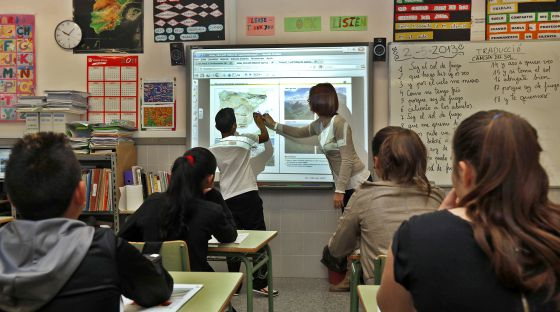

*¿conoces el potencial de la metodología design thinking para docentes? ¿eres un profesional del conocimiento dedicado a la enseñanza? ¿como docente te gustaría ser más eficaz y útil a ojos de tus alumnos?*

El Design Thinking para docentes podría ser tu herramienta de autoaprendizaje y evolución constante, independientemente de tu experiencia, o incluso posible falta de equipamiento o recursos materiales. 

No importa cómo te denomines: docente, profesor, maestro, pedagogo, instructor, formador, educador, enseñante, adiestrador, maestro, didáctico, académico, normativo, purista, clásico, culto, asesor, consejero, facilitador, promotor, orientador, coordinador, consiliario, tutor, gestor, mentor, guía, gurú, mediador, conductor, …

**No pierdas la oportunidad de tomar al menos unas ideas al respecto de esta metodología, tanto si estás dentro de la formación reglada, como si tienes la suerte de diseñar tu propia formación a medida, e independientemente de que tus alumnos sean niños, adolescentes o adultos experimentados.**

Tampoco importa cuales sean tus limitaciones concretas en tu entorno como docente para conseguir ser más útil y eficaz, si aplicas metodologías de innovación como el Design Thinking. 

**Si quieres que te avise de otras reflexiones como esta, y además acceder a formación gratuita entorno a los conceptos del pensamiento visual, te invito a suscribirte para no perderte nada.**

[***¡Ok, me apunto!***](https://www.pensamientovisual.es/suscripcion/)

- - - - - -

**Importante mencionar que el Design Thinking NO es DISEÑO, y SÍ una metodología para resolver problemas innovando.**

Aunque siempre ayude… no es necesario disponer ni de mucho dinero, ni tampoco de mucha tecnología o recursos para llevar a cabo la metodología eficazmente.

En el caso de aplicación del Design Thinking para docentes, destacar que **No implica necesariamente:**

- Aferrarse a los consejos de veteranos docentes, expertos en pedagogía, o incluso “la pedagogía de salón” de expertos ajenos al aula. 
- Tampoco confiar sólo en tu experiencia y visión de la enseñanza.

Yo mismo tampoco pretendo mostrarte aquí con el “Design Thinking para docentes” ningún secreto ni visión de la enseñanza, sino mostrarte herramientas más visuales que te permitan descubrirlo y experimentarlo por ti mismo, afrontando así las cambiantes dificultades para atender la diversidad en el aula.

El Design Thinking para docentes **SI implicaría** necesariamente:

- Rediseñar el aula entrevistando a tus alumnos… para así entenderlos mejor y lograr que se sientan más comprometidos a cambiar su ambiente de aprendizaje. 
- El docente se convierte en el diseñador de su propia experiencia en el aula, profesionalizando su rol, y permitiendo así un cambio más valioso y auténtico, impulsado por las necesidades reales de los alumnos.

Mas información: [Metodología Design Thinking y Pensamiento Visual](https://www.pensamientovisual.es/metodologia-design-thinking-pensamiento-visual/)

La pregunta clave a responder para **enfocar adecuadamente el Design Thinking** para docentes podría ser: 

**¿qué más puedo hacer para que el curso, clase, ponencia o charla sea más atractiva para mis alumnos u oyentes profesionales?**

**Tienes que diseñar una solución a su medida y bajo tus posibilidades.**

Aunque no seas diseñador propiamente dicho, como docente y educador, **también diseñas cuando:** 

- Buscas nuevas formas de enseñar contenidos con mayor eficacia. 
- Optimizas los recursos y el espacio del aula de manera diferente.
- Desarrollas nuevos enfoques para conectar con tus alumnos.

¡El Design Thinking tiene su base en la resolución de problemas desde el punto de vista del usuario, y en este caso del alumno!

Si observas la siguiente fotografía… ¿qué ves? ¿que se te ocurre para mejorarla?

Teacher Ewesit Centrine teaches children under trees at a mobile school some 50 kilometres from Lodwar , Turkana, Kenya, 24 June 2013. Picture/Karel Prinsloo/ ARETE

Fuente fotografía: http://www.unescocv.org/la-ayuda-a-la-educacion-disminuido-en-un-10-desde-2010/

- **Observas: ves una formación con aparentes pocos recursos en un lugar humilde.**
- **Piensas: incluir una escuela, sillas, mesas, pizarras interactivas,… y mil cosas más entorno a los itinerarios formativos, etc**
- **Resultado: acabas diseñando la escuela típica del mundo desarrollado**

Fuente fotografía: [http://ccaa.elpais.com/ccaa/2013/05/07/valencia/1367951113\_103239.html](http://ccaa.elpais.com/ccaa/2013/05/07/valencia/1367951113_103239.html)

¿cuál es realmente más efectiva?

¿lo que conocemos es lo correcto?

¿lo has mejorado?

Mi respuesta es: depende. 

¿cuál está realmente adaptada a las circunstancias y cumple su objetivo?

¿qué es lo que realmente necesitan los verdaderos protagonistas, los alumnos?

- - - - - -

Opino que es bueno ver extremos como estos para comprender mejor la realidad, poder obtener una perspectiva general, y en definitiva poder ver tanto el árbol como el bosque.

¡Enfoca los problemas como un novato, incluso si ya sabes mucho de ellos!

Como Einstein dijo en su famosa frase: *«No podemos resolver problemas utilizando el mismo tipo de pensamiento que usamos cuando los creamos».*

En la primera imagen, en lo relativo únicamente a la enseñanza, igual no hay tantos problemas como en la segunda imagen… ¿quién sabe? Esto es sólo un ejercicio de reflexión.

Si analizas los problemas que se esconden en la segunda imagen tal vez podrías pensar que son la dificultad de atender la diversidad en el aula, la falta de esfuerzo del alumnado, el escaso apoyo de la administración, o incluso también la falta de equipamiento y recursos materiales.

Como primera parte de aplicación de la citada metodología, este sería un buen ejemplo de análisis de los problemas, pero igual más visto desde la perspectiva de los profesores.

**Si quieres focalizarte en tu caso concreto, tratando de usar el Design Thinking para docentes con la finalidad de “ver con los ojos de tus alumnos”, en tu mano estaría analizar de este modo los problemas reales de tus alumnos.**

- - - - - -

***REFLEXIÓN:***

1. En la primera imagen, igual lo único que necesitan estos alumnos es que no haya conflictos en su entorno, o que sus padres tengan trabajo y recursos para que ellos puedan ir a la escuela sin tener que trabajar. Aunque esta escuela sea tan solo sentarse debajo de un árbol a la sombra a escuchar a un interesante profesor.
2. Los problemas reales de los alumnos de la segunda imagen, y los de tu caso concreto, no seré yo quien los mencione, ni probablemente en manos de nadie en concreto está “la solución”. En la de todos, pero sobre todo en tu mano está descubrirlos, tal vez con esta herramienta que te presento.

- - - - - -

**Como docente, el enfoque no lo deberías dirigir a los profesores, y sí a los estudiantes, y no ver a estos como receptores de información, y sí como forjadores de conocimientos.**

El Design Thinking para docentes o no docentes, en general es una metodología que puedes ver más en detalle aquí: [Metodología Design Thinking y Pensamiento Visual](https://www.pensamientovisual.es/metodologia-design-thinking-pensamiento-visual/)

**Esta metodología tiene un gran componente visual y por ello resulta tan eficaz, incluyendo una serie de herramientas prácticas que tendrás que adaptar, proporcionando gran flexibilidad de trabajar dentro de tus propias limitaciones.**

Cuando nos enfrentemos a un problema podemos resolverlo de forma analítica, pero también con “el pensamiento de diseño”, en este caso el Design Thinking para docentes.

Para todos el tiempo es valioso y limitado, al mismo tiempo que las exigencias son altas, por lo que a menudo sentimos que nuestros métodos y burocracia instaurada no es tan ágil, ni lo suficientemente flexible como para mantenerse al día frente a la rápida evolución de las necesidades. 

Sin embargo, en nuestra mano siempre está el poder desarrollar y potenciar las habilidades para resolver este tipo de desafíos. 

Al respecto mencionar que **dentro de la** **metodología Design Thinking** **se agrupan variadas técnicas muy en sintonía con potenciar el pensamiento visual**, y que sirven para profundizar en la metodología:

- *Mapa de actores*
- *Observación encubierta*
- *Mapa de empatía*
- *Técnica de los 5 porqué*
- *La saturación y agrupación*
- *La generación de entrevistas *
- *La documentación de historias. *
- *Mapa de stakeholders*
- *Shadowing*
- *Entrevistas en contexto*
- *Pruebas culturales*
- *Etnografía móvil*
- *Técnicas de creatividad*
- *Diseño de escenarios*
- *Storyboards*
- *Service Staging*
- *Co-creación*
- *Storytelling*
- *Blueprint y Roleplay de servicios*
- *Business Model Canvas*
- *…..*

Experimenta con estos “procesos de diseño”, y comienza ya a enfrentar los “problemas” de un modo diferente aplicando el Design Thinking para docentes como una metodología que te permite descubrir una nueva perspectiva de tu trabajo como docente y profesional del conocimiento.

Aunque no tengas claro qué hacer, el sólo pensar en el proceso de Design Thinking te permitirá tener un enfoque más rupturista y propenso a solucionar problemas.

**Si quieres saber un poco más sobre el pensamiento visual, suscribete gratis a la web para no perderte nada, y poder así acceder a la zona privada formativa con el ABC del Pensamiento Visual.**

*[¡Ok, me apunto!](https://www.pensamientovisual.es/suscripcion/)*

.

*Si te ha gustado, ayúdame* *a difundirlo por las redes sociales. ¡gracias! 😉*