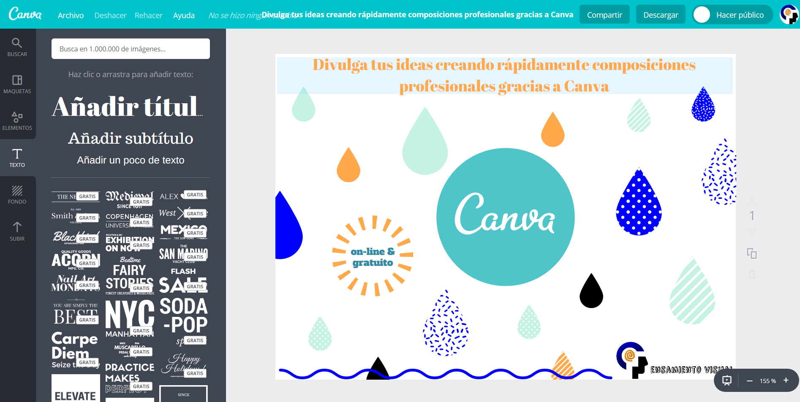
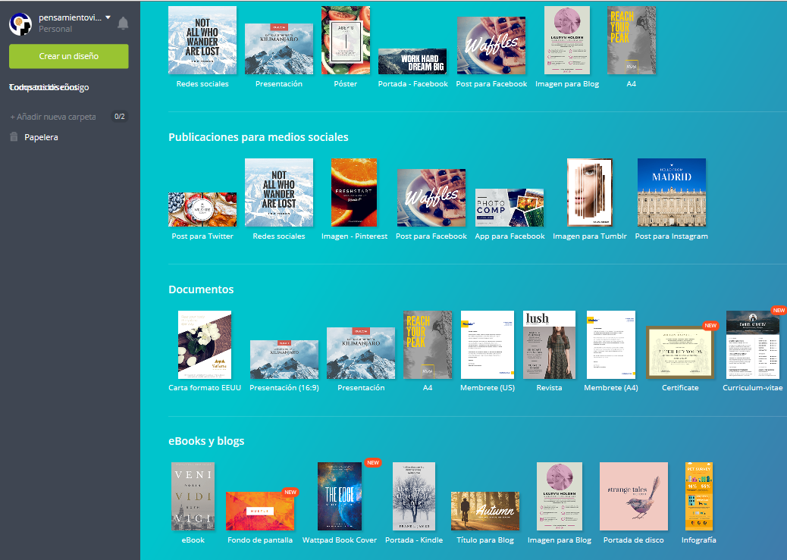

*¿te gustaría divulgar tus ideas de modo profesional? ¿no te crees capaz de crear composiciones profesionales y divulgativas? ¿conoces la herramienta CANVA?*

Te presento una herramienta gratuita y online con la que podrás divulgar tus ideas de un modo muy rápido y a la vez profesional.

**La herramienta Canva es a la vez sencilla, intuitiva y completa.**

Te recomiendo probarla y verás cómo en unos minutos ya te enganchará, ya que se maneja prácticamente sin necesidad de explicación ninguna, pero además con resultados como te digo profesionales.

Es una aplicación on-line y gratuita, y no necesitas pagar para nada, ni tampoco deja marcas de agua en tus composiciones finales como sí ocurre con muchas otras herramientas gratuitas.

Por otra parte, si que hay ciertos elementos (fotos, símbolos, plantillas,…), que no tienes porque usar, pero que puedes optar por incluirlos en tus diseños por un simbólico precio de 1 euro por elemento. Pero repito, no es necesario en absoluto: ejemplo imagen del post!

- - - - - -

***Un momento… ¿Canva no era otra cosa?***

 ***¡ hagamos un paréntesis!***

*Canvas es una palabra de origen inglés que se utiliza con frecuencia para hacer referencia a documentos que ayudan y guían en el diseño creativo.*

*Por otra parte, seguro que te suena…*

***Canvas de modelo de negocio:*** *es una herramienta nueva, que hace unos años (2010) vio la luz gracias al libro “Generación de modelos de negocio” (Business Model Generation) escrito por Alex Osterwalder e Yves Pigneur.*

*Es una magnífica guía para visionarios, revolucionarios y retadores como TÚ! que quieren desafiar los anticuados modelos de negocio y diseñar las empresas del futuro.*

Pero ahora no te voy a presentar eso…

…hablamos de una herramienta online, también llamada CANVA, y que te ayudará sin duda a promocionar ese modelo de negocio, ese marketing online y visual…

…y en definitiva divulgar tus ideas!

- - - - - -

**Canva es una potente herramienta online de diseño gráfico, con millones de usuarios en todo el mundo y con versión en español.**

Como persona multipotencial y/o profesional del conocimiento, si quieres elaborar una imagen para divulgar tus ideas en un post, presentación, o clase,… necesitas herramientas sencillas, ya que no dispones de mucho tiempo precisamente.

¡Necesitas herramientas online, gratuitas, potentes y fáciles de usar!

¡Te presento CANVA!

Aunque seguro que no te importaría empezar a aprender un poco más de diseño porque es algo fascinante, útil y en cierto modo necesario…

… si realmente no eres diseñador, ni quieres contratar uno, **lo mejor que puedes hacer para ser eficiente en tu labor divulgadora es conocer herramientas de diseño como CANVA.**

Esta herramienta online te permite a golpe de ratón y con unos pocos “clicks” divulgar tus ideas creando todo tipo de imágenes profesionales. Y todo ello, arrastrando y soltando elementos, de forma muy intuitiva.

**Si quieres que te avise de otros recursos como estos, y además acceder a más información sobre los conceptos del pensamiento visual, te invito a suscribirte para no perderte nada.**

[*¡Ok, me apunto!*](https://www.pensamientovisual.es/suscripcion/)

- - - - - -

**¿Por qué te la recomiendo?**

- No necesitas instalar nada en tu ordenador, ya que funciona online, y esto te permite trabajar desde cualquier parte y sin depender de ningún equipo en concreto.
- Te permite crear rápidamente composiciones profesionales aunque no tengas conocimientos de diseño, ni seas bueno dibujando, ni con la edición.
- Incluye un montón de elementos a un golpe de click: fotos de archivo, vectores, ilustraciones, filtros, plantillas, iconos, stickers,…
- Además de todo lo que te ofrece gratis para utilizar en tus diseños, también te permite subir tus propias fotos e imágenes.
- Cualquier puede aprender a manejarlo en unos minutos!

**¿Qué necesitas para empezar?**

1. Un PC, portatil, tablet, movil,.. lo que sea con conexión a internet.
2. Crear una cuenta de usuario gratuita.
3. Ganas de divulgar tus ideas visualmente.

**¿Qué puedes realizar en sólo unos minutos?**

En cada tipo de diseño puedes elegir entre un montón de layouts (diseños predefinidos) que puedes alterar a tu gusto:

- Publicaciones para medios sociales: post Twitter, imagen Pinterest, post Facebook,..
- Documentos: carta, presentación 16:9, membrete, revista, A4, certificado,…
- Marketing: flyer, póster, menú restaurante, tarjeta visita, cheque regalo,..
- Eventos: postal, invitación boda, tarjeta, collage fotos,…
- fondo pantalla, eBook, portada Kindle, título Blog, portada disco, infografía,…

**¿Cómo divulgar tus ideas rápidamente?**

Sin lugar a dudas por internet: presentaciones online, entradas blog, webinars, redes sociales,…

1. Crea con CANVA una imagen relacionada con el contenido que vas a publicar.
2. Puedes incluir en la imagen una llamada a la acción con tu URL objetivo.
3. Si dispones de blog añádela a tu siguiente entrada como imagen destacada.
4. Utiliza tu imagen única para divulgar esa entrada en todas las redes sociales.

¡Verás cómo consigues divulgar tus ideas!

**¿es realmente una buena herramienta para crear tus imágenes únicas?**

- Canva supera con creces a todas las aplicaciones adaptadas para no diseñadores.
- 1.600 millones de personas pueden usar la herramienta en su idioma nativo.
- Desde 2014 se han creado más de 80 millones de diseños, a un ritmo de 3 diseños por segundo.
- Y lo mejor… **convierte en diseñadores a los que no lo somos!**

En definitiva, CANVA es una magnífica herramienta muy fácil de utilizar para divulgar tus ideas, al poner a tu alcance el potencial del diseño gráfico de alta calidad con diseños predefinidos elegantes y modernos.

*¿por qué no la pruebas y me das tu opinión?*

[**www.canva.com**](http://www.canva.com)

*Estaré encantado de recibir tu feedback*

- - - - - -

**Si quieres aprender más sobre el pensamiento visual, te invito a suscribirte gratis a la web para no perderte nada, y poder así acceder a la intranet formativa con el ABC del Pensamiento Visual.**

[¡Ok, me apunto!](https://www.pensamientovisual.es/suscripcion/)

.

*Si te ha gustado, ayúdame* *a difundirlo por las redes sociales. ¡gracias! 😉*