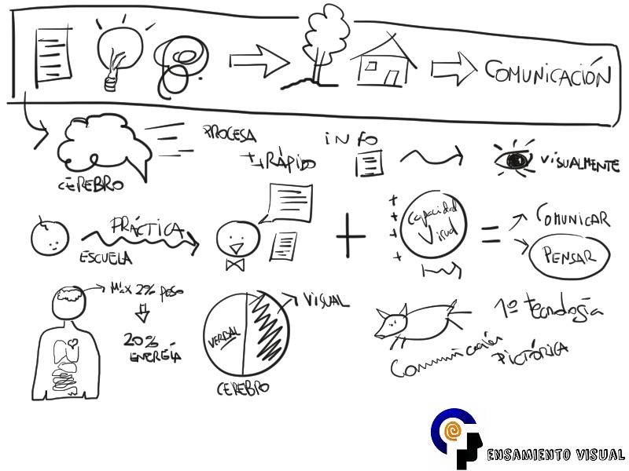
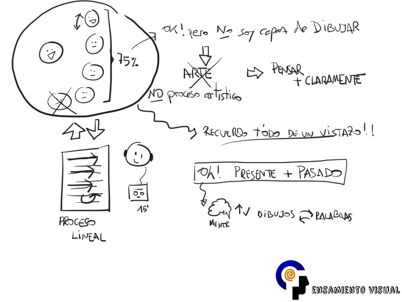
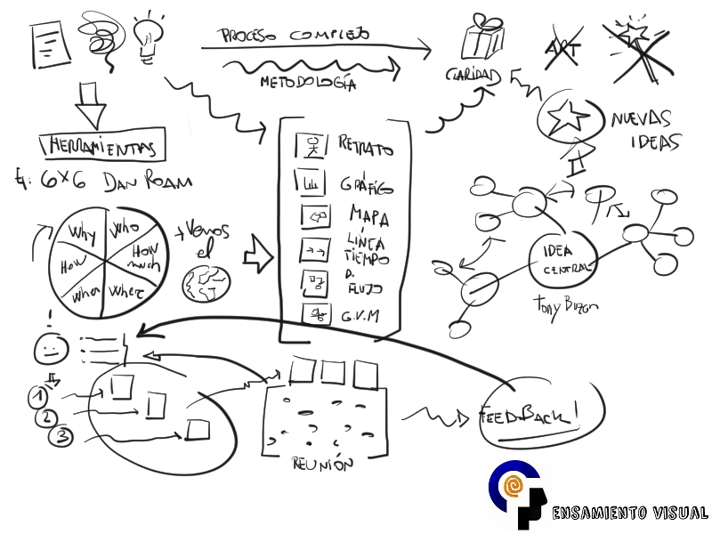

***SI NECESITAS COMUNICAR TUS IDEAS Y CONOCIMIENTOS… ¿SÓLO LO HARÁS VERBALMENTE?***

Claramente los que aporten valor a sus clientes mediante el uso de la comunicación visual, tendrán la ventaja respecto los que no lo hagan y sigan limitando su potencial de divulgación.

¿A quién elegirán? Probablemente al que sea capaz de aportar valor del modo más eficaz y cercano, siendo esto especialmente reseñable si eres un profesional del conocimiento.

*Según Dan Roam: “El pensamiento visual significa aprovechar la capacidad innata para descubrir ideas que de otro modo serían invisibles, desarrollarlas rápida e intuitivamente y luego compartirlas con otras personas de manera que puedan entenderlas de forma inmediata. No existe mejor forma de constatar que realmente sabemos algo que dibujándolo.”*

***¿POR QUÉ?***

Tanto si quieres aprender, cómo mostrar tu conocimiento, transmitir tus ideas, innovar o resolver problemas propios o ajenos, te animo a que cuando la situación lo recomiende, lo hagas mediante el uso de dibujos, ya que esto mejorará tu capacidad de divulgación y de comunicación.

**Esto es así ya que nuestro cerebro procesa de un modo mucho más rápido la información si esta se presenta de modo visual.**

Realmente todos desde pequeños practicamos durante un montón de años, primero escuchando nuestro entorno, luego ya en la escuela, todo lo relacionado con el lenguaje, nuestro idioma y la comunicación verbal. Durante años de escucha pasiva, y práctica activa, finalmente conseguimos dominarlo por partes: escritura, lectura, discursos orales,…

En definitiva con la práctica y uso, acaba por formar parte de nosotros, como una eficaz habilidad que no cuestionamos usar para comunicarnos; salvo el miedo escénico o similares. Eso realmente esta genial!

Deberías sin embargo cuanto antes dar la importancia que se merece a incluir tu enorme capacidad visual, que en realidad es mayor que lo correspondiente a lo verbal.

Rápidamente verás que con muchísima menor práctica, casi despreciable en comparación con el esfuerzo para lo verbal que se requiere, (y si no recuerda lo que cuesta aprender un idioma…) mejorarás enormemente tu capacidad para COMUNICAR y PENSAR: algo que sin duda te hará muchísimo más capaz en tu labor autodidacta y divulgadora.

**Algunas referencias importantes:**

1. La mitad de nuestro cerebro procesa los datos e información de un modo integral y espacial, que podríamos catalogar como pensamiento visual.
2. El **hemisferio derecho** es el encargado de la visión de conjunto de la información, dotándonos de orientación espacial, y mostrándonos el color, la forma y posición para darnos en definitiva la percepción del mundo.
3. El **hemisferio izquierdo** sería el correspondiente a la parte verbal, al procesar un pensamiento lineal y analítico.
4. *Tras la 2ª Guerra Mundial, investigadores como Williams (1986) trataron de rehabilitar heridos en el hemisferio derecho con técnicas de enseñanza entorno al pensamiento visual.*
5. El **cerebro supone como máximo un 2% del peso** de nuestro cuerpo, pero eso no significa que no represente uno de los procesos más importantes al **consumir el 20% de nuestra energía el sólo.** Por tanto, está clara la importancia del pensamiento visual, ya que seamos o no conscientes de ello, nuestro cuerpo requiere constantemente para ello energía para su funcionamiento. ¿Lo puedes dejar pasar por alto realmente?

Si bien el lenguaje y la comunicación verbal es algo relativamente complejo de asimilar como hemos comentado, atendiéndonos a la historia lo visual no lo es, ya que ello permitió a nuestros antepasados prehistóricos comunicarse mediante dibujos cuando vivían en las cavernas.

**Las pinturas rupestres son la primera tecnología de comunicación pictórica.** **Una comunicación visual que ha llegado a nuestros días tras miles de años.**

***VISUAL &amp; VERBAL***

Consideremos gráficamente que tenemos un orador que está tratando de difundir la idea del potencial que tiene el PENSAMIENTO VISUAL para la comunicación, transmisión de conocimiento e ideas, etc…

.. y frente al mismo presentamos una audiencia de profesionales del conocimiento e inquietos como tú, y todo ello lo vamos representando visualmente.

Los datos esclarecen:

1. Habrá alguna persona especialmente muy de acuerdo y motivada. **(espero que seas tú!)**
2. Tal vez otra totalmente en desacuerdo que incluso lo ridiculice.
3. En general la mayoría, lo que podría ser un **75% llega a la conclusión de que está conforme con los razonamientos** presentados, pero que en definitiva simplemente no se ven capaces de dibujar… y esto es únicamente por sentir en cierto modo miedo!

**La única forma de avanzar entonces es asimilar de una vez por todas, de que hacer uso del pensamiento visual y los dibujos, no tiene que suponer un proceso artístico ni mucho menos.**

**Únicamente hay que entender que el objetivo es que tanto tú mismo cómo tu audiencia o clientes podáis todos COMUNICARSE y PENSAR + CLARAMENTE.**

En contrapartida, si tratamos de COMUNICARNOS VERBALMENTE mediante un escrito…

1. Podemos ver que es un proceso lineal que avanza siguiendo una dirección de un principio a un fin.
2. Para una persona que tenga que atenderlo y asimilarlo es realmente algo complejo de entender y seguir salvo que permanezca muy atento a todo el desarrollo, tanto si lo escucha como si lo lee.
3. Probablemente acabe escaneando la información y volviendo atrás para entender algún nuevo punto que se basa en información previa.
4. Y ya no digamos si se trata de una conversación grabada. Igual ha durado varios minutos, y para acceder a la información tenemos que volver a escucharlo todo.

**Si realmente lo hemos esquematizado de algún modo mediante dibujos lo podremos ver todo a la vez, y con ello recordarlo todo.**

Si elaboramos un dibujo que representa toda un conversación o escrito, previamente este nos ayuda a seguir y asimilar la información durante su desarrollo bien seamos receptores o comunicadores, como después de ocurrida gracias a que la mente es muy buena relacionando palabras y dibujos.

Por ello, **podemos de un modo bastante sencillo recordar la mayor parte de la información que había acorde a los dibujos con sólo verlos… CASI MÁGICO!**

**Si quieres que te avise de otros recursos como estos, y además acceder a más información sobre los conceptos del pensamiento visual, te invito a suscribirte para no perderte nada, así como acceder a la intranet formativa de modo gratuito.**

[*¡Ok, me apunto!*](https://www.pensamientovisual.es/suscripcion/)

***¿CÓMO?***

Supongamos que quieres aplicar el pensamiento visual y ponerlo en práctica…

…quieres partir de un problema, idea o conocimiento a transmitir y/o analizar, y convertirlo en un elemento que aporte en sí mismo claridad, pero esto realmente es un proceso complejo que requiere de una metodología y práctica.

**Insisto en que no se trata de un proceso artístico o mágico. Hay que aplicar una serie de fórmulas para pasar de lo confuso a lo visualmente claro.**

Para ello puedes hacer uso de una serie de **herramientas como por *ejemplo el 6×6 que presenta Dan Roam.*** *Esta metodología trata de descomponer los conceptos en varias partes en base a una serie de preguntas:*

*¿Who-quién?*

*¿How much-cuánto?*

*¿Where- dónde?*

*¿When-cuándo?*

*¿How-cómo?*

*¿Why-por qué?*

*¡ Esto realmente no deja de ser cómo realmente vemos con nuestro cerebro el mundo!*

*La contestación de cada pregunta se refleja como un dibujo básico, que será para..*

*Quién=retrato*

*Cuanto=gráfico*

*Dónde=mapa*

*Cuándo=línea tiempo*

*Cómo=diagrama flujo*

*Por qué= gráfico variables múltiples….*

Otra herramienta que puedes usar se basa en los ***mapas mentales de Tony Buzan, en los cuales partiendo de una idea central vamos desarrollando las ideas de modo ramificado*** a partir de esa idea central, buscando relaciones.

Este método genera muchas correlaciones que te darán como fruto la generación de nuevas ideas y claridad, que de otro modo no habrían sido fácilmente detectadas.

**Importante:**

- Todo lo comentado te servirá finalmente para presentar tu conocimiento e ideas bien en una reunión, una conversación, tu blog, un webinar,..
- La preparación para una correcta exposición visual empieza mucho antes. Tienes que pensar visualmente con antelación, recapitulando todo aquello que quieres transmitir y sacar de ello las ideas principales con las que quieres que se quede y lo que realmente recordará tu audiencia.
- **Cada idea la traducirás en una imagen: dibujo, esquema…. y en el momento de la presentación bien las dibujaras o simplemente mostrarás como complemento a tu exposición y explicaciones.**
- El proceso empieza analizándolo previamente y mostrándolo a posteriori, por lo que no tienes que ser ningún crack del dibujo ni de la presentación u oratoria.
- Te recomiendo que analices todo el feedback que puedas para aprender de ello y mejorar de cara a la próxima preparación que se te presente.

- - - - - -

**Si quieres aprender más sobre el pensamiento visual o [Visual Thinking](https://www.pensamientovisual.es/que-es-el-visual-thinking/), te invito a suscribirte gratis a la web para no perderte nada, y poder así acceder a la intranet formativa con el ABC del Pensamiento Visual.**

[¡Ok, me apunto!](https://www.pensamientovisual.es/suscripcion/)

<https://www.pensamientovisual.es/producto/abc-pensamiento-visual/>

.

*Si te ha gustado, ayúdame* *a difundirlo por las redes sociales. ¡gracias! 😉*