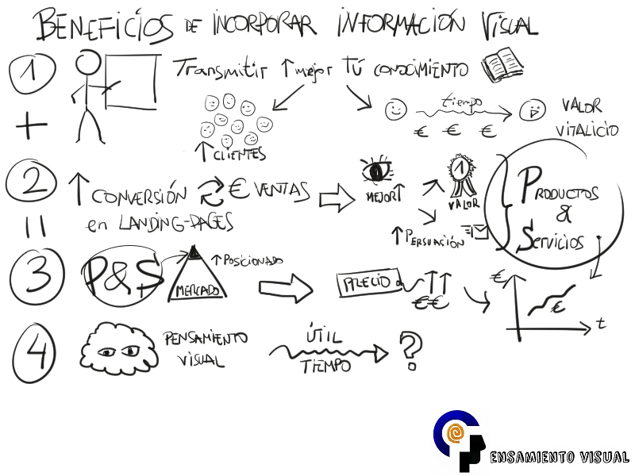

*¿eres consciente de que un mayor uso de imágenes e información visual por tu parte puede hacer aumentar tus ventas? ¿eres un profesional del conocimiento abierto a mejorar su comunicación para satisfacer mejor a sus clientes y en definitiva vender más? ¿Qué tal si añades más info visual siempre que puedas?*

Una aplicación en la que el pensamiento visual puede ayudar en tu negocio, y especialmente a ti como profesional del conocimiento, es el hábito de incorporar imágenes e información visual siempre que puedas.

En definitiva, haz uso de imágenes que venden.

¿cómo?

Realmente no se trata del uso de algún tipo de imagen “mágica” que haga aumentar tus ventas y la satisfacción de tus clientes.

Únicamente **se trata de usar imágenes con el propósito y enfoque adecuado, y de este modo sí que te serán realmente rentables en su uso.**

Considera como idea general el incorporar información visual siempre que te sea posible.

**BENEFICIOS DE INCORPORAR INFORMACIÓN VISUAL**

En primer lugar, como profesional del conocimiento, el aportar tu conocimiento y prestación de servicios con el uso de elementos visuales siempre que te sea posible, influirá directamente en transmitir mejor tu conocimiento.

Esto te supondrá una clara mejora en tu cuenta de resultados por dos motivos:

- *ANTES: captar más clientes por la calidad de tu información gratuita y testimonios*
- *DESPUÉS: con tus servicios de pago afianzar clientes aumentando su valor vitalicio, porque se dan cuenta de que aprenden de verdad y solucionan sus problemas con claridad*

En segundo lugar te puede ayudar al aumento de las tasas de conversión de tus “landing-pages”, lo que se traducirá en más clientes y más ingresos.

El motivo es que en general tus páginas de ventas se verán mejor con un mayor uso de información visual.

- *A tu cliente le será más fácil percibir el auténtico valor que quieres demostrar*
- *tu mensaje puede aumentar en su nivel de persuasión*

Estos dos aspectos mostrarán mucho mejor a tu cliente tus productos y servicios. Una mejor comprensión de los mismos repercutirá en más clientes, y por tanto más ventas.

**Si juntamos los beneficio del punto 1 (transmitir mejor tu conocimiento) y del punto 2 (mejorar visualmente tus páginas de venta), tendríamos el punto 3: Productos y Servicios mejor posicionados respecto la competencia.**

¿y esto en que se traduce?

Puedes poner los precios más caros, aunque sólo sea porque ya haces algo diferente a la mayoría.

En definitiva, conectas mejor con tu cliente y encuentras la llave de su mente.

A la vez, él descubre tu verdadero valor, por lo que acaba por implicarse más, y eso quiere decir confía en ti y consume tus productos y servicios.

En cuarto lugar, podemos destacar el beneficio de que en definitiva potencies el uso del pensamiento visual.

La práctica en su uso se convertirá en un conocimiento tuyo para siempre, y de aplicación atemporal para cualquier nuevo negocio o disciplina en la que te adentres.

**Si quieres que te avise de otros recursos como estos, y además acceder a más información sobre los conceptos del pensamiento visual, te invito a suscribirte para no perderte nada.**

[*¡Ok, me apunto!*](https://www.pensamientovisual.es/suscripcion/)

- - - - - -

**IDEAS DONDE INTRODUCIR IMÁGENES QUE VENDAN**

Lo resumimos en 3 puntos.

En primer lugar usa imágenes siempre que quieras **EXPRESAR EMOCIONES**.

¡ Por cierto, haz esto siempre que puedas!

El motivo es que las emociones juegan el papel más importante en las decisiones de compra, y su correcto uso supone también una proximidad con tu cliente.

Conecta de modo genuino con las emociones de tu cliente: sueños, temores, aspiraciones,…

… y dirige tu acción para entrar en su mente.

¡ Pero hazlo de modo “coloquial” y de modo próximo: «tú” a “tú!

*¿un ejemplo?*

*El uso de historias que a todo el mundo hacen captar la atención.*

*El saber el final entretiene, nos mantiene atentos, se produce empatía y ello te puede permitir ganar tiempo para conducir a tu cliente hacia la acción deseada.* *¿Qué mejor modo que contar historias que con imágenes?*

*Le podemos llamar Visual Storytelling*

Busca anécdotas pasadas y tus pequeñas historias que conecten con tus productos y servicios prestados, así como la historia y/o misión de tu empresa.

En segundo lugar para potenciar tu **RELEVANCIA**.

Pero no para hablar sobre ti, impresionar y aburrir con lo bueno que eres, ya que eso no interesa a nadie. No se trata tanto de mostrar tus títulos y logros como de centrarte en ser relevante para solucionar los problemas de tu cliente y punto.

¡ Muestra tu promesa!

*T**al problema… cruzar un río.*

*Tal solución… construir un puente.*

Céntrate en los puntos de dolor de tu cliente, que no son más que aquellos problemas por los que pagarían para solventarlos. Pero no se trata de demostrar tus dotes artísticas sino de ser capaz de mostrar lo que tu cliente quiere ver.

Puedes usar imágenes también en aspectos más sencillos, como fotografías de tus clientes junto con sus testimonios, mostrar gráficamente resultados que pueden obtener, comparativa de tu oferta, o gestionar objeciones con imágenes que muestren garantías, tiempo prueba,… o simplemente el lugar donde te pueden localizar para así mostrar cercanía.

**¿Qué mejor modo de mostrar tu relevancia y gestionar las objeciones que puedan surgir que mostrando parte de tus productos y servicios?**

Por ejemplo, permite a tus potenciales clientes el poder visualizar parte de tus Infoproductos de pago; si es mediante un video o acceso a tu plataforma de enseñanza mucho mejor.

En tercer lugar, usa más imágenes para **MEJORAR TU CONTENIDO**.

¿Qué mejor manera para resaltar los puntos principales y transmitir conocimiento que con imágenes?

Especialmente en todo tu contenido gratuito, las imágenes ayudarán a resaltar lo que serían los titulares, facilitando la inevitable tarea de “escaneo” de la información de todos tus lectores y potenciales clientes.

Todo esto no se traduce en venta directamente, pero sí permite que sigan leyendo y documentándose contigo, encontrando así la llave a su mente.

En definitiva **tus clientes verán mejor los conceptos y su importancia, y con ello estarán más satisfechos.**

El uso de información visual no tiene que ser muy elaborada ni tan siquiera llevar color.

En ocasiones **cualquier “borrón” junto con una palabra es suficiente**, y esto permite ver el significado de ese dibujo poco artístico, pero con mayor relevancia que si estuviera la palabra sola.

Usa las imágenes en general también intercalándolas para dar un **respiro visual al texto escrito**: algo que cada día más pereza da seguir por motivo del exceso de información de que disponemos.

*Desmárcate de la competencia y de la información básica y aburrida, usando mucho más las imágenes y la información visual en general.*

*¿te animas ya?*

- - - - - -

**Si quieres aprender más sobre el pensamiento visual, te invito a suscribirte gratis a la web para no perderte nada, y poder así acceder a la intranet formativa con el ABC del Pensamiento Visual.**

[¡Ok, me apunto!](https://www.pensamientovisual.es/suscripcion/)

.

*Si te ha gustado, ayúdame* *a difundirlo por las redes sociales. ¡gracias! 😉*