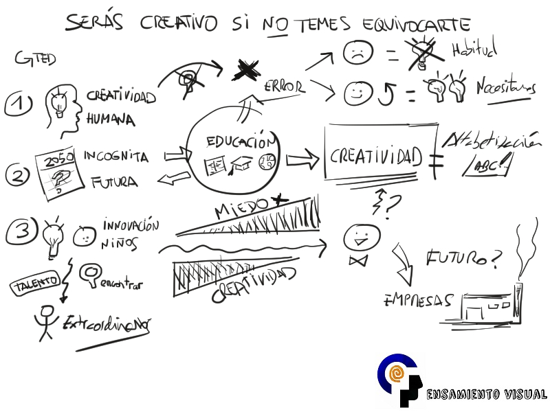

<iframe allowfullscreen="allowfullscreen" frameborder="0" height="200" id="audio_17070546" scrolling="no" src="https://www.ivoox.com/player_ej_17070546_4_1.html?c1=ff6600" style="border: 1px solid #EEE; box-sizing: border-box; width: 100%;" width="300"></iframe>

Te presento en esta ocasión un “VisualTED” que he elaborado sobre una de las charlas TED más importantes que se recuerdan.

Se trata de la charla de ***Ken Robinson de 2006***, en la que plantea de manera entretenida y conmovedora la necesidad de crear un sistema educativo que nutra, en vez de socavar, la creatividad.

**En definitiva considera que las escuelas matan la creatividad, y eso no tiene futuro.**

Esta charla TED concuerda totalmente con mis propias reflexiones al plantearme el pensamiento visual.

Se mencionan los problemas del sistema educativo que se encuentra obsoleto, y las dificultades que la sociedad nos impone para desarrollar toda nuestra creatividad al condenar en cierto modo el error y el fallo en nuestras acciones y decisiones.

Lo que Ken Robinson pone de manifiesto, es que **es necesario potenciar otros métodos de aprendizaje y enseñanza, resolución de problemas y respaldo de la creatividad, y esto es algo que considero que podemos conseguir gracias a utilizar mucho más nuestro pensamiento visual.**

*“VisualTED” – Ken Robinson: las escuelas matan la creatividad:*

<iframe allow="encrypted-media" allowfullscreen="" frameborder="0" gesture="media" height="281" src="https://www.youtube.com/embed/a-GT-tHAS2A?feature=oembed" width="500"></iframe>

**SERÁS CREATIVO SI NO TEMES EQUIVOCARTE**

Para empezar pone de manifiesto algunas de las ideas más reseñables de las charlas TED acordes al tema a presentar.

1. En primer lugar la extraordinaria capacidad de Creatividad Humana, demostrada con cada charla TED.
2. En segundo lugar la Incógnita Futura que se plantea en reiteradas ocasiones.
3. Finalmente el potencial de innovación que demuestran los niños. Especialmente demostrado cuando encuentran su talento, y se vuelven extraordinarios. Algo al alcance de todo el mundo.

La incógnita del futuro tiene una relación clara con la educación, algo que nos interesa a todos.

Por una parte es donde ponemos nuestras esperanzas al educar a las futuras generaciones para ese futuro incierto. Pero realmente lo hacemos erróneamente, ya que no se puede formar a nuestro hijos en base a las experiencias y necesidades actuales, ya que enseguida estarán desfasadas.

**Dentro de la educación es vital empezar a dar protagonismo y fomentar la Creatividad, teniendo que llegar a considerarla algo básico como la alfabetización.**

La educación que conocemos castiga el error…

… por lo que indirectamente las escuelas matan la creatividad!

ya que para poder ser creativo no hay que temer a equivocarse.

Pero la conclusión de esto evidentemente no es que para potenciar la creatividad humana busquemos el error.

La clave de todo se basa en cómo actuamos ante la aparición del error:

- Habitualmente lo consideramos algo negativo, y eso nos lleva a una pérdida de creatividad.
- Si tratamos de verlo como algo bueno que nos empuje a volverlo a intentarlo nuevamente, potenciaremos enormemente la creatividad, y esto es lo que realmente necesitamos.

**En realidad más que potenciar la creatividad, simplemente tenemos que intentar no perderla, ya que es innata a nosotros desde niños.**

Cuando somos pequeños no tememos dibujar, expresarnos, preguntar o decir lo que podrían ser barbaridades, ya que no tenemos miedo a “meter la pata”, y esto nos hace muy creativos.

Conforme crecemos, la sociedad, y muy especialmente el sistema educativo, nos hace cada vez tener más miedo al error, y con ello se va perdiendo la creatividad.

En la mayoría de los casos para cuando llegamos a ser adultos…

¿queda algo de creatividad?

**El problema es que con esa falta de creatividad y alto nivel de miedo al fracaso es cómo luego se dirigen las empresas.**

**Si quieres que te avise cuando reseñe otras fantásticas charlas TED como esta, y además acceder a más información sobre los conceptos del pensamiento visual, te invito a suscribirte para no perderte nada.**

[*¡Ok, me apunto!*](https://www.pensamientovisual.es/suscripcion/)

- - - - - -

**SISTEMA EDUCATIVO MUNDIAL OBSOLETO**

El sistema educativo es básicamente el mismo en todo el mundo, y está obsoleto.

En general el esquema no cambia, dando a diario materias como matemáticas y lenguaje, y de modo testimonial el arte o la música, dejando en el olvido el drama o la danza. No potencia las habilidades corporales, y sólo se centra en potenciar el cerebro, y sólo una parte de él.

Si consideramos cuál sería la élite de los adaptados al sistema educativo, lo que realmente se busca y se potencia, llegamos a la conclusión de que es en cierto modo una fábrica de profesores universitarios.

¿podemos considerar esto un logro para la sociedad?

**Sólo se está poniendo en valor la habilidad académica.**

**¿esto sería una sociedad ideal?**

**Esto es una visión errónea de inteligencia, porque descarta gente brillante con otros potenciales.**

Las materias que se potencian son aquellas que sirven para lo que en el siglo XIX se consideraba útil, de cara a trabajar en lo que fue el periodo de la industrialización. En esa época ello significaba trabajo, dinero y futuro.

En contrapartida el resto de materias no tenía sentido potenciar ya no tenía futuro ser músico o artista, ya que eso no presuponía un futuro.

**En la actualidad tener un título no asegura un trabajo, ya que nos encontramos ante una burbuja de inflación académica…**

**¿la solución?**

**Reestructurar el sistema educativo y potenciar la creatividad, considerando una visión más amplia de inteligencia.**

La inteligencia se presenta de varias formas:

- Por una parte es diversa: visual, sonidos y kinestésica.
- También es dinámica e interactiva, ya que la creatividad es la capacidad de visión de conjunto de varias disciplinas.
- Y también es única cuando descubrimos nuestro talento.

*Te recomiendo que no dejes de ver al menos una vez la charla TED al completo de Ken Robinson, ya que además del mensaje de fondo que te he adelantado, podrás francamente disfrutar de la divertida presentación que realiza con muchas anécdotas y con humor:*

<iframe allowfullscreen="" frameborder="0" height="375" mozallowfullscreen="" scrolling="no" src="https://embed.ted.com/talks/lang/es/ken_robinson_says_schools_kill_creativity" webkitallowfullscreen="" width="500"></iframe>

Para terminar, lo que te recomiendo es que archives las imágenes mostradas para tenerlas siempre presentes; tal vez en Instagram. Te vendrán bien cuando busques inspiración, necesites desarrollar algún tema relacionado, o simplemente quieras repasar rápidamente estos conceptos que son como pequeñas píldoras de conocimiento y reflexión universal.

- - - - - -

**Si quieres aprender más sobre el pensamiento visual, te invito a suscribirte gratis a la web para no perderte nada, y poder así acceder a la intranet formativa con el ABC del Pensamiento Visual.**

[¡Ok, me apunto!](https://www.pensamientovisual.es/suscripcion/)

.

*Si te ha gustado, ayúdame* *a difundirlo por las redes sociales. ¡gracias! 😉*