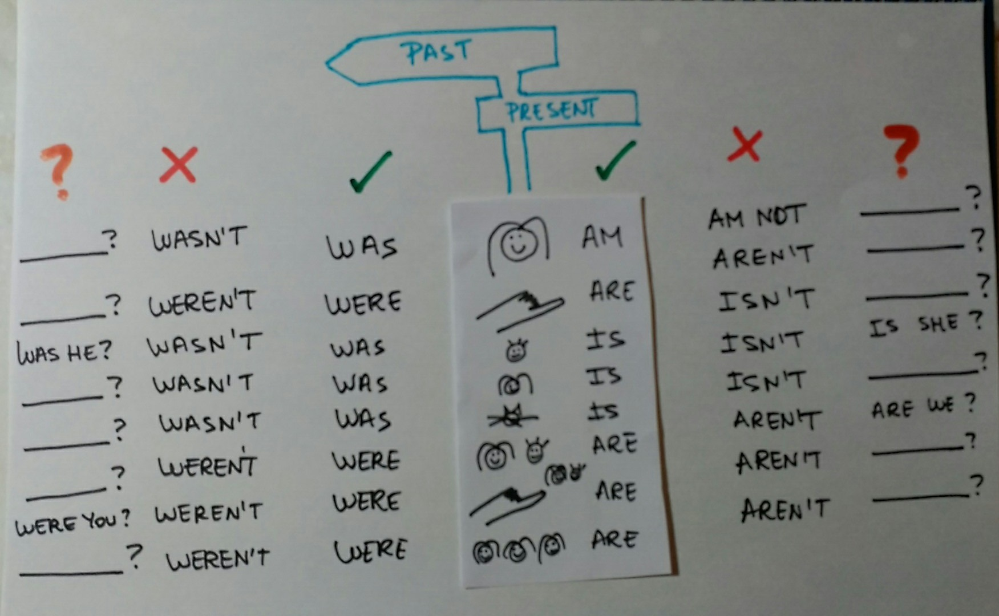
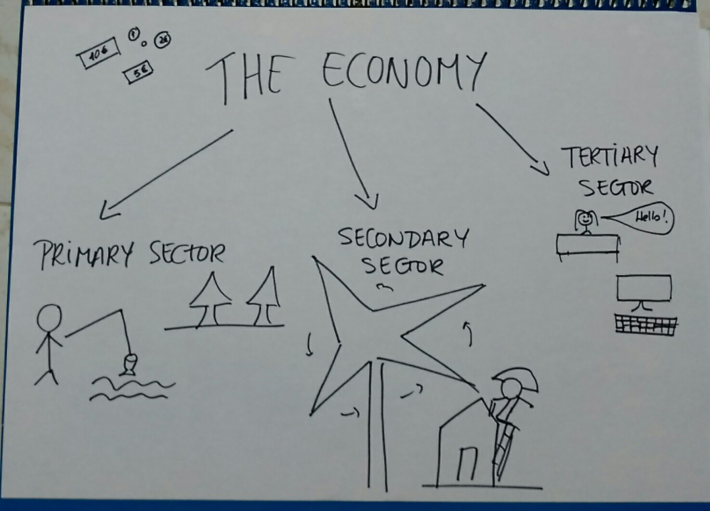
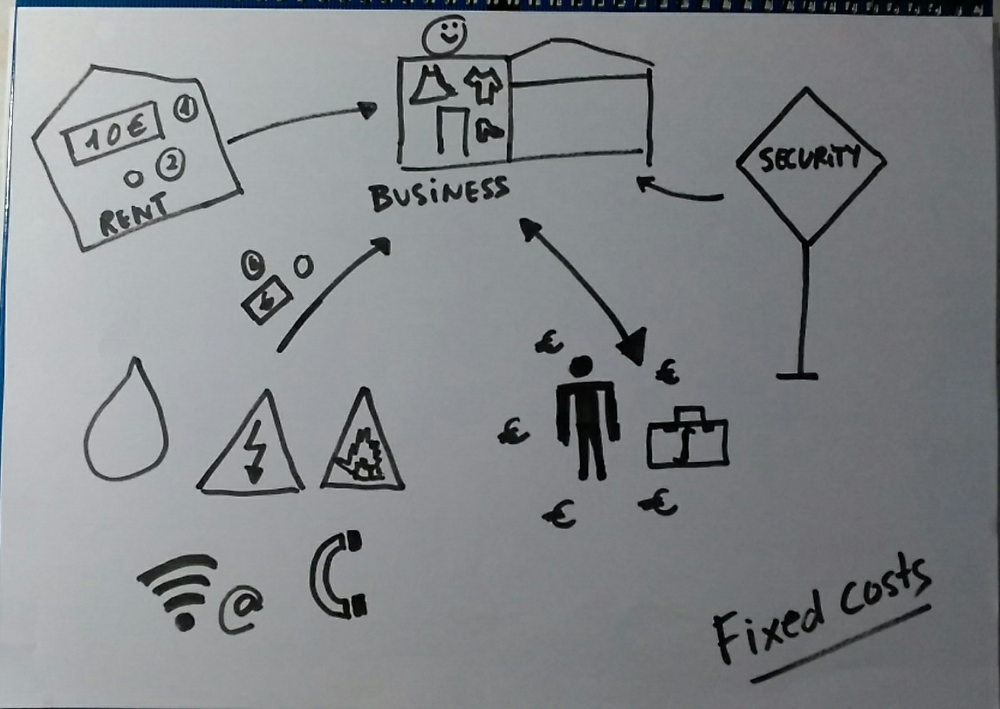
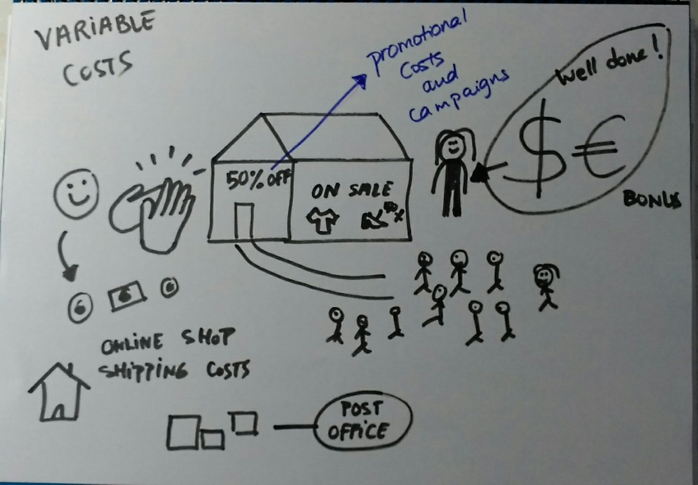
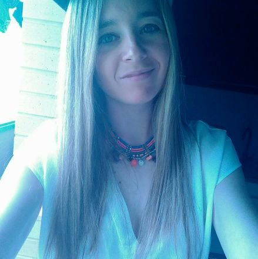

### **PRESENTACIÓN**

Mi nombre es Leticia Urbiola, soy de un pueblo llamado Dicastillo, situado en la zona media de Navarra (Tierra Estella).

Soy maestra especialista en lenguas extranjeras (inglés) y actualmente trabajo como profesora de inglés en el Colegio Público Remontival de Estella, Navarra.

Mi colegio es un colegio de Educación Infantil, Educación Primaria y Educación Especial.

Yo doy clase en el modelo PAI a los alumnos/as de 6º de Primaria (11 años).

Las asignaturas que imparto son English, Science, Maths y Art.

Todas mis clases son en inglés. 😉

Hace un tiempo, sentí curiosidad sobre cómo aplicar el Visual Thinking en la enseñanza y me decidí a formarme.

¡Desde entonces, aún no he parado de practicarlo!

.

- - - - - -

### **ENCUESTA DOCENTES VISUAL THINKING**

**¿ Conoces el Visual Thinking?**

Conozco y uso el Visual Thinking desde que me formé en un curso para profesores.

**¿Visual Thinking como estrategia educativa?**

Uso el Visual Thinking como estrategia educativa, y tanto como para el propio desarrollo profesional como para ayudar a los alumnos/as.

**Visual Thinking para…**

Pienso que es una nueva metodología que pocos profesores conocen, o que si conocen, no utilizan. Y que por supuesto, ayuda a los alumnos a entender la programación.

**¿Qué te preocupa a la hora de utilizarlo?**

Lo que más me preocupa a la hora de usarlo es que no se entienda bien el concepto, o lo que realmente quiero mostrar con mi dibujo.

**¿Visual Thinking aporta calidad comunicativa?**

Muestra una gran calidad comunicativa, ya que como su nombre dice, es como diría yo… ¡más que visual! 😉

**¿Mejor nivel formativo para aplicarlo?**

Pienso que podemos usar esta técnica en cualquier etapa educativa, adaptando los dibujos y palabras a cada etapa.

**¿Cuales son tus preferencias de comunicación docente?**

Mis preferencias de comunicación docente son la visual y auditiva.

### → ACCESO ENCUESTA ←

- - - - - -

### **MI EXPERIENCIA COMO DOCENTE**

**OBJETIVOS**

Uso el Visual Thinking para conseguir dos objetivos en mi clase:  
1\. Para ayudar en la explicación de una manera más gráfica y visual.  
2\. Y/o como una actividad.

**¿CÓMO LO HAGO?**

Hay veces que preparo el trabajo en casa y lo llevo al aula ya hecho.

He de decir que todavía soy primeriza en el desarrollo del Visual Thinking y hay veces que tengo que pensar cómo puedo hacer el trabajo para que se entienda mejor… algo a la vez bastante divertido! 😉

Hay otras veces que voy dibujando conforme voy hablando y dando una explicación en clase.

**BENEFICIOS EN EL AULA**

Cuando doy las explicaciones con Visual Thinking, mis alumnos/as prestan más atención puesto que los «dibujos» les llaman la atención.

Después de cada explicación, lo que suelo hacer es repetir la explicación con la ayuda de algún alumno/a para ver si lo han entendido.

He notado mucha mejoría en este sentido, ya que los alumnos pueden relacionar los dibujos con la teoría importante fácilmente.

Cuando dibujo mientras explico, mis alumnos/as disfrutan mucho porque intentan adivinar y enlazar la explicación con lo que yo voy dibujando y escribiendo.

¡Ellos mismos me dicen que quieren todas las explicaciones así!

Para ellos es muy divertido y lo ven como una competición en el que juegan «a ver quién acierta antes» el qué estoy dibujando. 😉

- - - - - -

**Leticia Urbiola, profesora de inglés.**

*“Passionate Maestra, teacher. I work in a Spanish state school. I help my students with my webpage”.*

Twitter: @leti\_urbi

No os perdáis visitar mi página web: [**wearewhatwelearn.weebly.com**](http://wearewhatwelearn.weebly.com)

- - - - - -

**Para profundizar un poco más en el Visual Thinking, pudiendo volverte tu también más visual, te recomiendo suscribirte gratis a la web para poder así acceder a la intranet formativa con el ABC del Pensamiento Visual.**

**[¡Ok, me apunto!](https://www.pensamientovisual.es/suscripcion/)**

.

*Si te ha gustado, ayúdanos* *a Leticia y a mí a difundirlo por las redes sociales. ¡gracias! ?*