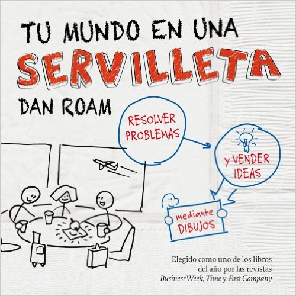
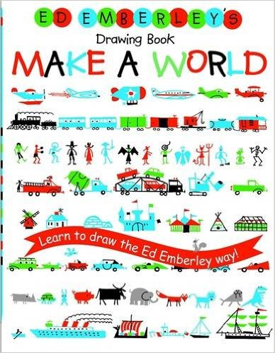
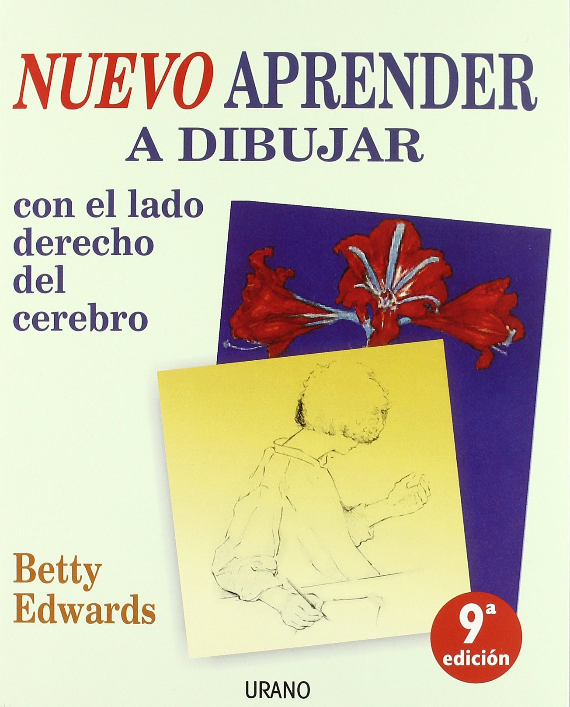
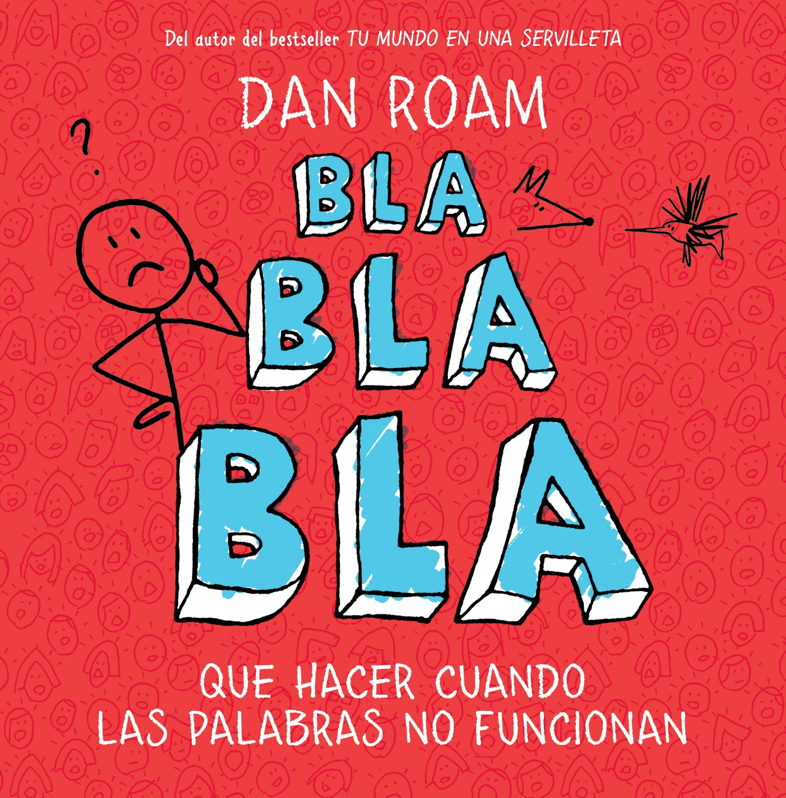
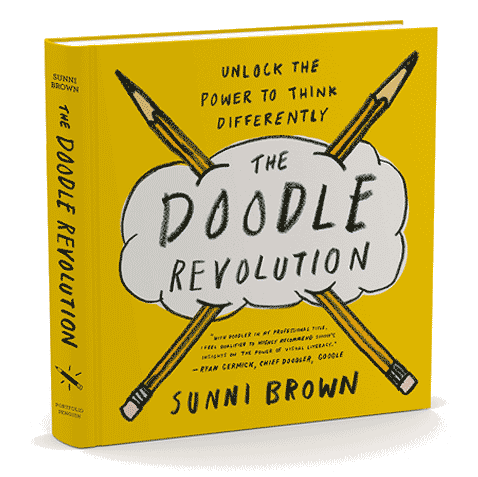
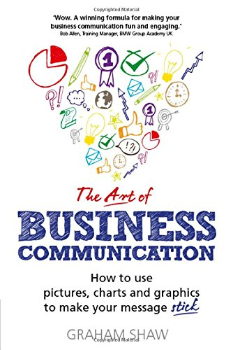

Espero sea útil para los PROFESIONALES DEL CONOCIMIENTO, y para todo aquel que quiera profundizar en esta interesante materia del pensamiento visual o visual thinking:

- Todos los blogueros y profesionales del conocimiento online
- Profesores con ganas de revolucionar los métodos de enseñanza y aprendizaje
- en general… a las [personas multipotenciales](https://www.pensamientovisual.es/pensamiento-visual-personas-multipotenciales/)!

- - - - - -

¡ MISIÓN!

**Mi objetivo se basa en ayudar a los PROFESIONALES DEL CONOCIMIENTO, potenciando el uso de las habilidades innatas que todos tenemos entorno al Pensamiento Visual, de manera que podamos aumentar y divulgar nuestro conocimiento e ideas de una manera más eficaz, rápida y entretenida.**

- - - - - -

En este listado sólo indico aquellos libros que conozco en profundidad, y que cumplen como mínimo que ya han pasado por las siguientes fases:

1. Los he comprado y están a mi disposición
2. Los he leído y estudiado a fondo
3. He realizado un post propio en el blog tratándolos individualmente

La lista aumentará con vuestra ayuda, y conforme los vaya presentando en la web progresivamente, pero sólo una vez como digo pasen por las anteriores fases.

En cualquier caso…

¡ Estaré encantado de escuchar propuestas para incluir otros libros visual thinking!

Y también… ¡ tus comentarios y opiniones!

Evidentemente además de que los conozca en profundidad… como no podía ser de otra manera tienen que estar relacionados y ser útiles para potenciar el pensamiento visual, tratando:

- Conceptos pensamiento visual o visual thinking
- Análisis de aprendizaje y enseñanza más visual
- Técnicas de dibujo, infografías,…
- Resolución de problemas
- Representación de datos, presentaciones,…

**Si quieres que te avise cuando reseñe otros libros como estos, y además acceder a más información sobre los conceptos del pensamiento visual, te invito a suscribirte para no perderte nada, así como acceder GRATIS a la intranet formativa con el ABC del Pensamiento Visual de modo gratuito.**

[*¡Ok, me apunto!*](https://www.pensamientovisual.es/suscripcion/)

- - - - - -

El siguiente listado de libros visual thinking o pensamiento visual, que te presento para que profundicemos en esta interesante materia dispone de:

- Para profundizar un poco puedes acceder en cada caso a un post propio de cada libro clicando en la imagen o título inicial
- Hay un pequeño adelanto escrito del correspondiente post para que no tengas que acceder si no quieres
- Facilito un enlace directo para su compra en Amazon. Agradezco que si te interesa algún libro lo compres desde estos enlaces, ya que esto no supondrá mayor coste para ti, pero me ayudarás como invitándome a un café… 😉 al yo recibir una pequeña comisión por mi recomendación como afiliado.

- - - - - -

[Dan Roam: Tu mundo en una servilleta](https://www.pensamientovisual.es/dan-roam-tu-mundo-en-una-servilleta/)
-------------------------------------------------------------------------------------------------------------

*¿Qué pasaría si existiera un modo de hacer más eficiente y divertida la solución de problemas? ¿conoces la mejor forma de constatar que realmente entiendes un tema y mostrarlo a tu cliente? ¿te gustaría descubrir ideas a priori invisibles, desarrollarlas rápida e intuitivamente, y luego compartirlas para una inmediata comprensión?*

La respuesta es **PENSAMIENTO VISUAL: resolver problemas y transmitir ideas mediante dibujos.**

Lo recomiendo totalmente como un primer acercamiento a este apasionante mundo con el que aprovechar esta capacidad innata que todos tenemos.

Dan Roam es un referente en el desarrollo y enseñanza del pensamiento visual, y concretamente ayuda a los ejecutivos a resolver problemas a través de esta temática.

[…seguir leyendo](https://www.pensamientovisual.es/dan-roam-tu-mundo-en-una-servilleta/)

<iframe style="width:120px;height:240px;" marginwidth="0" marginheight="0" scrolling="no" frameborder="0" src="//rcm-eu.amazon-adsystem.com/e/cm?lt1=_blank&bc1=FFFFFF&IS2=1&bg1=FFFFFF&fc1=000000&lc1=0000FF&t=regalosveganos-21&language=es_ES&o=30&p=8&l=as4&m=amazon&f=ifr&ref=as_ss_li_til&asins=8498754445&linkId=cb5d6b9694f0c1354352d266b45dce81"></iframe>

- - - - - -

[Ed Emberley-libros de dibujo esquemático](https://www.pensamientovisual.es/ed-emberley-libros-dibujo-esquematico/)
-------------------------------------------------------------------------------------------------------------------

*¿crees que no sabes dibujar? ¿No pones en práctica el pensamiento visual porque piensas que debes ser bueno dibujando? ¿eres consciente de que todo el mundo puede expresarse visualmente con simples dibujos esquemáticos igual que sin tapujos ya hacen los niños?*

**Yo mismo pienso que No se dibujar, pero desde la perspectiva y enfoque artístico, ya que para poder comunicarnos visualmente y poner en práctica el pensamiento visual sí que podemos considerar que tu, yo y todo el mundo sabe dibujar lo suficiente para ello.**

Efectivamente ser un dibujante a nivel artístico requiere como todo en la vida un mínimo de aprendizaje, constancia y mejora continua, y seguramente algo de talento y por supuesto interés por la temática.

Por el contrario, ser un dibujante aprendiz para aplicar el pensamiento visual, y comunicarse visualmente creo que está al alcance de todo el mundo, como puede estar al alcance de todos el poder comunicarnos escribiendo de modo verbal.

[…seguir leyendo](https://www.pensamientovisual.es/ed-emberley-libros-dibujo-esquematico/)

<iframe style="width:120px;height:240px;" marginwidth="0" marginheight="0" scrolling="no" frameborder="0" src="//rcm-eu.amazon-adsystem.com/e/cm?lt1=_blank&bc1=000000&IS2=1&bg1=FFFFFF&fc1=000000&lc1=0000FF&t=informate-21&language=es_ES&o=30&p=8&l=as4&m=amazon&f=ifr&ref=as_ss_li_til&asins=0316789720&linkId=adcedd45b16eeb2561211abf1878a96c"></iframe>

- - - - - -

[Christian Leborg: Gramática visual](https://www.pensamientovisual.es/christian-leborg-gramatica-visual/)
---------------------------------------------------------------------------------------------------------

¿Y si existiera una guía de consulta para descodificar y producir mensajes visuales? ¿te gustaría descubrir un libro a medio camino entre tratado sobre gramática visual y diccionario visual? ¿quieres descubrir el punto de partida idóneo para iniciarse en la alfabetización gráfica?

Lo recomiendo como guía de consulta, muy visual y rápido de ver, leer y escanear en cualquier momento.

Señalar que el autor de este libro sobre gramática visual Christian Leborg es diseñador y consultor de branding, por lo que **su enfoque parece más artístico y estético**, aunque al plantearse muy sencillo y también muy gráfico, creo que puede llegar a lectores con perfiles muy diferentes que tengan curiosidad en torno al pensamiento visual.

[…seguir leyendo](https://www.pensamientovisual.es/christian-leborg-gramatica-visual/)

<iframe style="width:120px;height:240px;" marginwidth="0" marginheight="0" scrolling="no" frameborder="0" src="//rcm-eu.amazon-adsystem.com/e/cm?lt1=_blank&bc1=000000&IS2=1&bg1=FFFFFF&fc1=000000&lc1=0000FF&t=informate-21&language=es_ES&o=30&p=8&l=as4&m=amazon&f=ifr&ref=as_ss_li_til&asins=8425226457&linkId=7a3a9c0d110a0d012fe9952c677507aa"></iframe>

- - - - - -

[Aprender a dibujar con el lado derecho del cerebro](https://www.pensamientovisual.es/no-necesitas-talento-aprender-dibujar-lado-derecho-del-cerebro/)
------------------------------------------------------------------------------------------------------------------------------------------------------

¿crees necesitar tener un talento para dibujar? ¿no crees que puedes aprender a dibujar con el lado derecho del cerebro? ¿ y si además de aplicar el pensamiento visual lo haces con mejores dotes de dibujo?

Aunque a priori aplicar el pensamiento visual no requiere de dotes artísticas, con un poco de práctica y sin necesidad de ningún talento o don especial, también puedes desarrollarlo con más arte.

**¡Sólo se trata de aprender a dibujar con el lado derecho del cerebro!**

*“Aprender a dibujar con el lado derecho del cerebro”* es una de esas obras que por su originalidad e inspiración marcan un antes y un después, convirtiéndose en un punto de referencia en la materia. Traducida a trece idiomas, ha enseñado a dibujar a millones de lectores y ha servido de guía para miles de profesionales del arte.

[…seguir leyendo](https://www.pensamientovisual.es/no-necesitas-talento-aprender-dibujar-lado-derecho-del-cerebro/)

<iframe style="width:120px;height:240px;" marginwidth="0" marginheight="0" scrolling="no" frameborder="0" src="//rcm-eu.amazon-adsystem.com/e/cm?lt1=_blank&bc1=000000&IS2=1&bg1=FFFFFF&fc1=000000&lc1=0000FF&t=informate-21&language=es_ES&o=30&p=8&l=as4&m=amazon&f=ifr&ref=as_ss_li_til&asins=8479537930&linkId=1a628c26823a5c1f6cc4cee7250b1cc8"></iframe>

- - - - - -

[“Bla, Bla, Bla: qué hacer cuando las palabras no funcionan”](https://www.pensamientovisual.es/bla-bla-bla-que-hacer-cuando-las-palabras-no-funcionan/)
-------------------------------------------------------------------------------------------------------------------------------------------------------------------------------------------------------

*¿eres consciente de que hablamos tanto que no pensamos bien? ¿después de escuchar a alguien te has quedado con la sensación de saber menos que al principio? ¿estas cansado de malgastar tu tiempo atendiendo algunos discursos, charlas y reuniones interminables y que no te aportan nada?*

***¡Bienvenido al mundo del Bla, Bla, Bla!***

Como predica [<u>Dan Roam en su “libro Bla Bla Bla”, </u>](http://amzn.to/2bawIgS)aunque las palabras tienen mucho poder, estamos engañados al pensar que las palabras por sí solas, pueden detectar, describir y resolver los problemas actuales y futuros.

¿sólo nos comunicamos con palabras?

¡ Esto es sin duda un grave problema de comunicación y entendimiento!

Según Dan Roam y su libro “Bla Bla Bla” la respuesta es **PENSAMIENTO VIVIDO: técnica que combina nuestra mente verbal y visual para que puedas pensar y aprender más rápido.**

[…seguir leyendo](https://www.pensamientovisual.es/bla-bla-bla-que-hacer-cuando-las-palabras-no-funcionan/)

<iframe style="width:120px;height:240px;" marginwidth="0" marginheight="0" scrolling="no" frameborder="0" src="//rcm-eu.amazon-adsystem.com/e/cm?lt1=_blank&bc1=000000&IS2=1&bg1=FFFFFF&fc1=000000&lc1=0000FF&t=informate-21&language=es_ES&o=30&p=8&l=as4&m=amazon&f=ifr&ref=as_ss_li_til&asins=8498751942&linkId=485963fcee6dcad7d37e0900bf5b6467"></iframe>

- - - - - -

[Libro de Sunni Brown: La revolución de los garabatos](https://www.pensamientovisual.es/libro-sunni-brown-revolucion-garabatos/)
--------------------------------------------------------------------------------------------------------------------------------

*¿te gustaría garabatear eficazmente? ¿quieres mejorar tu nivel de alfabetización visual? ¿sabes cómo aumentar tu capacidad de pensar y comunicar usando garabatos?*

Si quieres estar bien preparado en un mundo con cada vez mayor cantidad de información, una mayor alfabetización en lo visual mejorará notablemente tu capacidad por pensar y comunicar usando el pensamiento visual como una habilidad básica y esencial que yo entiendo que es.

¿una solución para mejorar todos estos aspectos?

El libro de Sunni Brown: La revolución de los garabatos. Un fantástico libro que te invita a reflexionar, aprender y dibujar… pero sólo garabatos!

**Sunni Brown presenta el “doodling” que significa “garabatos”, como herramienta básica para aprender y enseñar.**

¡Bienvenido al mundo de los garabatos!

[El libro de Sunni Brown “The Doodle Revolution: *Unlock the Power to Think Differently*](http://amzn.to/2cRriG8)” te anima a perder tu miedo por dibujar mediante el uso de garabatos, y te enseña técnicas que te ayudan a comunicar e innovar más fácil y eficazmente.

[…seguir leyendo](https://www.pensamientovisual.es/libro-sunni-brown-revolucion-garabatos/)

<iframe style="width:120px;height:240px;" marginwidth="0" marginheight="0" scrolling="no" frameborder="0" src="//rcm-eu.amazon-adsystem.com/e/cm?lt1=_blank&bc1=000000&IS2=1&bg1=FFFFFF&fc1=000000&lc1=0000FF&t=informate-21&language=es_ES&o=30&p=8&l=as4&m=amazon&f=ifr&ref=as_ss_li_til&asins=B011T7DWLQ&linkId=fb15ee4734925161d7918ff393c47839"></iframe>

- - - - - -

[Graham Shaw: The Art of Business Communication](https://www.pensamientovisual.es/graham-shaw-art-business-communication/)
--------------------------------------------------------------------------------------------------------------------------

*¿te gustaría poder comunicar sin que se distraiga tu audiencia? ¿quieres transmitir tus ideas de un modo diferente y memorable? ¿y si te animas a dibujar en vivo durante tus presentaciones?*

¡ Graham Shaw tiene la solución a tus problemas!

¡Simplemente dibuja tus ideas!

**Si quieres de una vez por todas conseguir comunicar tus ideas únicas, de un modo único, didáctico y atrayente, no busques nuevos programas, ni nuevas herramientas, ni nada sofisticado!**

**¡Convéncete de que tus aliados son los dibujos!**

[…seguir leyendo](https://www.pensamientovisual.es/graham-shaw-art-business-communication/)

<iframe style="width:120px;height:240px;" marginwidth="0" marginheight="0" scrolling="no" frameborder="0" src="//rcm-eu.amazon-adsystem.com/e/cm?lt1=_blank&bc1=000000&IS2=1&bg1=FFFFFF&fc1=000000&lc1=0000FF&t=informate-21&language=es_ES&o=30&p=8&l=as4&m=amazon&f=ifr&ref=as_ss_li_til&asins=B01K3RGQZW&linkId=dc4d4c175e64a1750a19e1743c554550"></iframe>

- - - - - -

[Mike Rohde: The Sketchnote Handbook](https://www.pensamientovisual.es/mike-rohde-the-sketchnote-handbook)
----------------------------------------------------------------------------------------------------------

*¿no sabes lo que es un Sketchnote? ¿te gustaría aprender cualquier cosa más eficazmente tomando apuntes más visuales? ¿y si tomar notas no es sólo usar palabras… pudiendo ser más divertido?*

Te presento uno de los libros de referencia dentro del Visual Thinking o Pensamiento Visual, y no sólo por su peculiar aspecto blanco, naranja, y negro! 😉

**¿pero qué es eso del Sketchnote?**

**En resumen sería como decir “apuntes visuales”.**

Realiza Sketchnote tanto para tomar notas durante una clase, conferencia, charla,… como también para aclarar las ideas de un podcast, libro o vídeo,… o incluso para inmortalizar momentos de tu vida cotidiana como viajes, comidas en restaurantes o películas vistas.

¡el uso dependerá de tu caso e imaginación!

[…seguir leyendo](https://www.pensamientovisual.es/mike-rohde-the-sketchnote-handbook)

<iframe style="width:120px;height:240px;" marginwidth="0" marginheight="0" scrolling="no" frameborder="0" src="//rcm-eu.amazon-adsystem.com/e/cm?lt1=_blank&bc1=000000&IS2=1&bg1=FFFFFF&fc1=000000&lc1=0000FF&t=informate-21&language=es_ES&o=30&p=8&l=as4&m=amazon&f=ifr&ref=as_ss_li_til&asins=013383171X&linkId=b4964bc302e15ed646e38b1717d817fa"></iframe>

- - - - - -

¿te ha gustado el recopilatorio de libros visual thinking?

¡compártelo en las redes sociales!

Espero que podamos seguir aumentando este listado de libros visual thinking con vuestra ayuda y sugerencias.

¡Gracias por los comentarios y opiniones!

Si compras alguno estaré encantado de escuchar tu opinión al respecto.

- - - - - -

**Si quieres aprender más sobre el pensamiento visual, te invito a suscribirte gratis a la web para no perderte nada, y poder así acceder a la intranet formativa con el ABC del Pensamiento Visual de modo gratuito.**

[¡Ok, me apunto!](https://www.pensamientovisual.es/suscripcion/)

*Si te ha gustado, ayúdame* *a difundirlo por las redes sociales. ¡gracias! 😉*