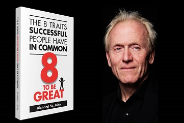
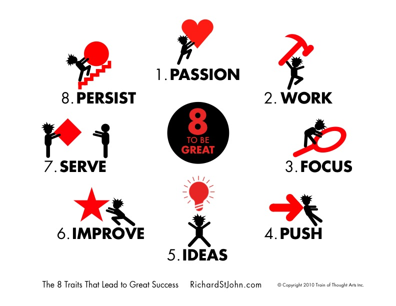
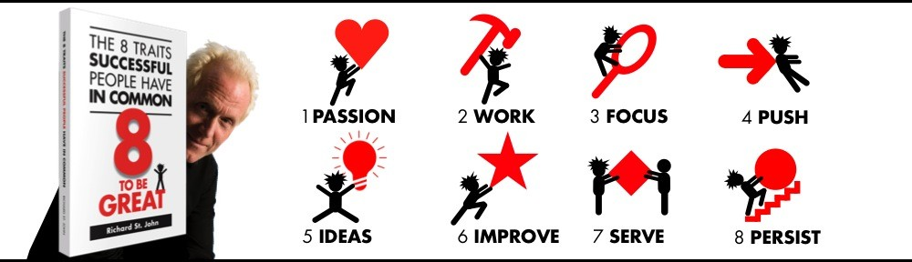
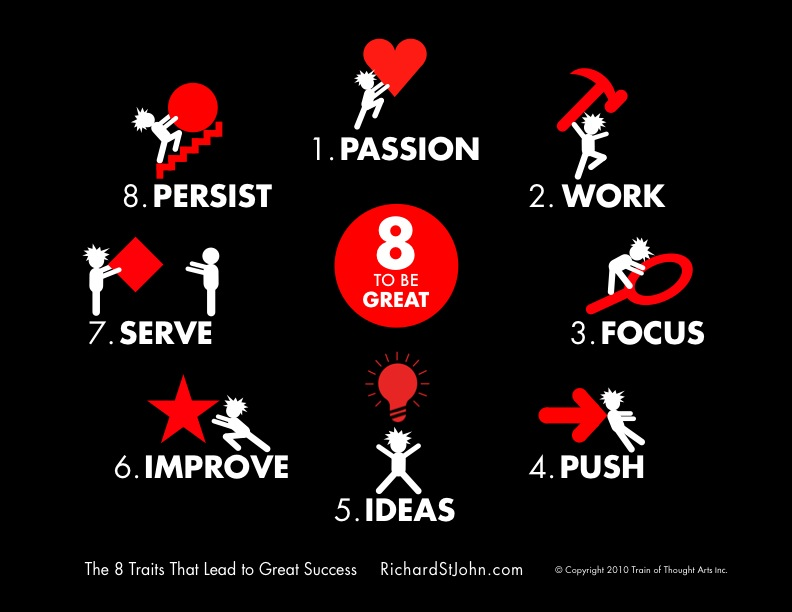
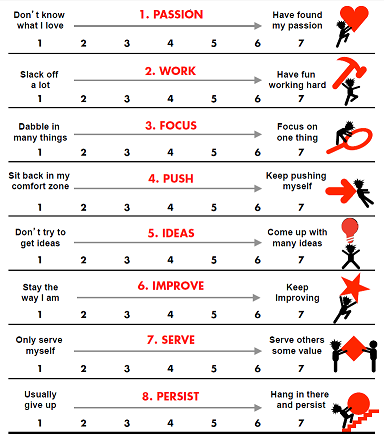

Te presento en esta ocasión un [“VisualTED”](https://www.pensamientovisual.es/tag/visualted/) que he elaborado sobre **una de las charlas TED más cortas de duración, pero que a la vez también es de las que más información util presentan de un modo muy rápido y visual.**  Se trata de la charla del analista Richard St. John, la cual destaca por:

1. Condensa 7 años de entrevistas a 500 personas exitosas.
2. Es una presentación de sólo 3 minutos.
3. Presenta visualmente los 8 verdaderos secretos del éxito.

**Richard St. John realizó más de 500 entrevistas cara a cara a muchas de las personas más exitosas del mundo**, incluyendo a Bill Gates, Martha Stewart, Richard Branson, los fundadores de Google, Rupert Murdoch,…

*¿Por qué las personas son exitosas?*

*¿Es debido a que son inteligentes?*

*¿O simplemente tienen suerte?*

**Según St. John, el éxito de las personas no es ni porque son inteligentes, ni tampoco porque tuvieron suerte.**

Analizó cada palabra que dijeron los exitosos entrevistados, las ordenó, organizó y correlacionó con todos los comentarios, y con ello creó una de las bases de datos más grandes y organizadas del mundo sobre los casos de éxito. Se describe como una persona común que encontró el éxito haciendo lo que le gusta, y que pasó más de una década investigando sobre las lecciones del éxito, para luego resumirlas en **8 palabras, 3 minutos y un libro exitoso:**

***Los 8 rasgos de las personas exitosas***

Opino que probablemente, además de un profesional del conocimiento, sea una [persona multipotencial](https://www.pensamientovisual.es/category/multipotencial/), ya que no parece ser periodista…

…pero abordó con mucho entusiasmo y ganas el escuchar lo que le tenían que decir personas exitosas de absolutamente todos los ámbitos y temáticas. Después de tanto tiempo y tanta información, apoyándose en los rasgos de las personas multipotenciales: síntesis, aprendizaje rápido y adaptabilidad… …fue capaz de condensar todo en 8 sencillos dibujos totalmente esclarecedores y de comprensión universal:

8 dibujos exito

Considero que esta charla TED que te presento en esta ocasión, y en general todos los videos de Richard St. John que puedes ver en su web (<http://www.richardstjohn.com/>), son un muy **buen ejemplo de aportar mucho valor práctico en muy poco tiempo, gracias a un uso magistral de las imágenes que le sirven para reforzar y resumir con un golpe de vista todo lo que quiere transmitir.** Realmente es uno de los mejores en el mundo transmitiendo valor, y creo que se puede deber a:

- Su enorme capacidad de síntesis
- Pinceladas de humor en todos sus videos
- ****Aplicación del [pensamiento visual](https://www.pensamientovisual.es/tag/pensamiento-visual/) al reforzar sus ideas con imágenes****
- Uso de imágenes muy sencillas!!!
- Y por su puesto… a que aplica los 8 secretos del éxito en sus presentaciones.

En esta ocasión como ya es muy buen ejemplo de charla TED con resumen visual la propia charla de sólo 3 minutos de Richard St. John, no realizaré un [“VisualTED”](https://www.pensamientovisual.es/tag/visualted/) propio ya que la charla en sí misma ya lo es:

<iframe allowfullscreen="" frameborder="0" height="375" mozallowfullscreen="" scrolling="no" src="https://embed.ted.com/talks/lang/es/richard_st_john_s_8_secrets_of_success" webkitallowfullscreen="" width="500"></iframe>

libro éxito Richard

**T****ranscripción:** *Esta es en realidad una presentación de dos horas que doy a estudiantes de secundaria recortada a tres minutos.*  *Todo comenzó un día en un avión, camino hacia TED siete años atrás.*  *En el asiento de al lado se encontraba una estudiante de secundaria, una adolescente que venía de una familia realmente pobre. Quería hacer algo con su vida, y me hizo una simple y pequeña pregunta.*  *Ella dijo, «¿Qué lleva al éxito?»*  *Y entonces me sentí realmente mal, porque no podía darle una buena respuesta.*  *Entonces, me bajé del avión y vine a TED. Y pensé, ¡Dios!, estoy en una habitación rodeado de personas exitosas.*  *¿Por qué no les pregunto qué les ayudó a ser exitosos, para enseñarselo a los jóvenes?*  *Entonces aquí estamos, después de siete años y 500 entrevistas, y voy a decirles, lo que realmente lleva al éxito y que hace actuar a los miembros de TED.*

1. **Lo primero es la Pasión. Freeman Thomas dijo, «Soy impulsado por mi pasión» Las personas en TED lo hacen por amor, no por dinero. Carol Colleta dijo, «Yo pagaría a alguien por hacer lo que yo hago». Lo curioso es que, Si lo haces por amor, el dinero viene de todas maneras.**
2. *¡Trabajo! Rupert Murdoch me dijo, «Todo es trabajo duro, Nada viene fácilmente. Pero me he divertido bastante». ¿Dijo diversión? ¿Rupert? ¡Sí! A las personas en TED les divierte el trabajo. Y trabajan muy duro. Yo pensé, ellos no son adictos al trabajo, son amantes del trabajo.*
3. *Y también es enfocarse. Norman Jewison me dijo, «Yo pienso que todo tiene que ver con enfocarse en una sola cosa».*
4. *Empujarte, David Gallo dijo, «Debes empujarte. física y mentalmente, debes empujarte, empujarte, empujarte». Debes empujarte a través de la timidez, y las dudas. Goldie Hawn dijo, «Siempre tuve dudas. No era lo suficientemente buena, no era lo suficientemente inteligente, no pensé que lo lograría». Ahora bien, nunca es fácil empujarte, y es por eso que inventaron a las madres. (Risas). Frank Gehry me dijo, «Mi madre me empujó».*
5. *¡Ideas! Bill Gates dijo, «Tuve una idea: fundar la primera compañía de programas para microcomputadoras». Diría que fue una muy buena idea. Y no hay magia en la creatividad en cuanto a ideas se refiere, es sólo hacer cosas bastantes simples. Y doy muchas evidencias de ello.*
6. *¡Ser bueno! Alex Garden dijo, «Para ser exitoso debes dedicarte a algo, y ser muy bueno en ello». No hay magia, todo es practicar, practicar, practicar.*
7. *¡Servir! Sherwin Nuland dijo, «Ha sido un privilegio servir como doctor». Ahora muchos niños me dicen que quieren ser millonarios. Y lo primero que les digo es, «Ok, pero no pueden servirse a ustedes mismos, deben servirles a otros con algo de valor. Porque esa es la manera en que las personas se vuelven ricas».*
8. *Persistencia. Joe Kraus dijo, «Persistencia es la razón número uno del éxito» Tienes que persistir a través del fracaso, y de CRAP (mierda), que por supuesto significa «Críticas, Rechazo, Assholes (idiotas) y Presión». (Risas)*

*Entonces, la respuesta a esta pregunta es simple: paga $ 4000 y ven a TED. Si eso falla, ten en cuenta las 8 razones, y créeme, estas 8 grandes razones, son las que llevan al éxito.*  *Muchas gracias TED, ¡y gracias por las entrevistas!*  

**Explicación de los 8 secretos del éxito:** Fruto de un trabajo de más de 7 años y 500 entrevistas a los personas más exitosas en todo el mundo, Richard St. John nos explica los 8 principios o secretos para alcanzar el éxito:

1. **PASIÓN**: Tienes que AMAR lo que haces, NO lo hagas por dinero. Elige una pasión y mantente motivado e impulsado hacia ella para generar o confirmar tu idea de negocio. Si manejas tu negocio con pasión el dinero llegará por sí solo, lo que a la inversa no necesariamente sucede. Lo más importante es recordar cada día que lo haces por amor y no por dinero.
2. **TRABAJO**: Tienes que trabajar duro, la vida no esta para recompensas fáciles. Nada es fácil, hay que trabajar mucho. Pero recuerda el punto anterior, si trabajas duro, pero amas lo que haces, entonces será divertido. Por otra parte, al mismo tiempo la satisfacción que generas por tu labor compensará los esfuerzos.
3. **ENFOQUE**: Enfócate en ser el mejor en una cosa, un tema, un proyecto. Dedica tus esfuerzos a un solo proyecto a la vez. No intentes abarcar dos proyectos al mismo tiempo aunque te cueste siendo una [persona multipotencial](https://www.pensamientovisual.es/category/multipotencial/).
4. **EMPUJE**: Empújate a hacer lo que tengas que hacer, y ejerce el empuje física y mentalmente. Olvídate de la timidez y la inseguridad. Presiónate física y mentalmente para cumplir con las tareas. Aclara tus dudas y miedos. Cree en ti mismo.
5. **IDEAS**: Genera ideas innovadoras: búscalas, investigalas y sobre todo aplícalas. No hay magia en la creatividad, solo tienes que escuchar, observar, ser curioso, hacer preguntas, resolver problemas y lograr conexiones: amplía tu red de contactos y rodéate de talentos.
6. **MEJORAS**: Tienes que esforzarte por ser el mejor, y para ser el mejor NO existen secretos: practicar, practicar y por último practicar. Se trata de **sobresalir o mejorar** en algo a fuerza de practicarlo. Para ser exitoso dedícate a una especialidad y vuélvete muy bueno en ello. No es magia: ¡practica, practica, y practica! Y no te olvides de promocionar claramente lo bueno que eres en tu actividad.
7. **SERVIR**: Tienes que brindarle a la gente productos y servicios que le agreguen valor a sus vidas. Servir a los demás con algo que tenga valor. Cuanto más grande sea ese valor, serás recompensado de mayor manera. Crea una oferta de valor y sirve a tus clientes. El valor que le pones será entendido y apreciado por los demás.
8. ******PERSISTIR**:**** Esta es la razón principal del éxito de muchas personas. Persistir frente al fracaso, la crítica, el rechazo, los que opinan por opinar, los pesimistas, y la presión social y psicológica. Muchas veces se persiste hasta el fracaso, pero esto NO debe suponer un problema, ya que el fracaso es un resultado que se puede cambiar. ******Sin duda persistir es la primera razón del éxito!******

- - - - - -

**Si quieres que te avise cuando reseñe otras fantásticas charlas TED como esta, y además acceder a más información sobre los conceptos del pensamiento visual, te invito a suscribirte para no perderte nada.**

[*¡Ok, me apunto!*](https://www.pensamientovisual.es/suscripcion/)

Te recomiendo que no dejes de ver al menos una vez la charla TED al completo de Richard St. John, e incluso que veas más videos suyos donde profundiza más sobre cada palabra clave del éxito.

Te propongo una reflexión:

¿en qué nivel de aplicación te encuentras dentro de cada uno de los 8 apartados presentados?

Si te consideras un profesional del conocimiento inquieto, o [persona multipotencial ](https://www.pensamientovisual.es/category/multipotencial/), tendrás algunos puntos que te cuesten más aplicar, y en cambio otros ya perfectamente resueltos.

Puedes puntuar dentro de una escala cada apartado usando la siguiente imagen que podrás descargar de la web de Richard St. John: <http://www.richardstjohn.com/>  Para terminar, lo que te recomiendo es que archives las imágenes mostradas para tenerlas siempre presentes; tal vez en Instagram.

[¿NO tienes claro todavía el potencial del pensamiento visual?](https://www.pensamientovisual.es/el-abc-del-pensamiento-visual/)

- - - - - -

**Si quieres aprender más sobre el pensamiento visual, te invito a suscribirte gratis a la web para no perderte nada, y poder así acceder a la intranet formativa con el ABC del Pensamiento Visual.**

[¡Ok, me apunto!](https://www.pensamientovisual.es/suscripcion/)

.

*Si te ha gustado, ayúdame* *a difundirlo por las redes sociales. ¡gracias! 😉*